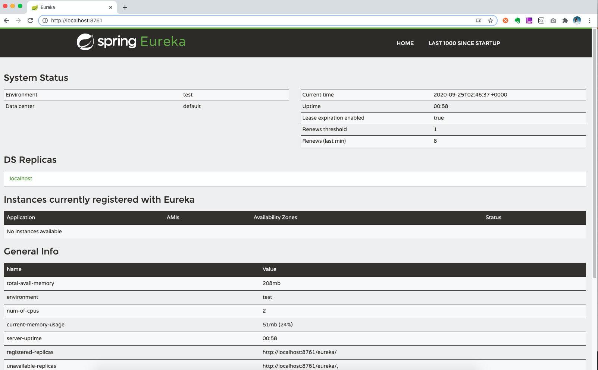
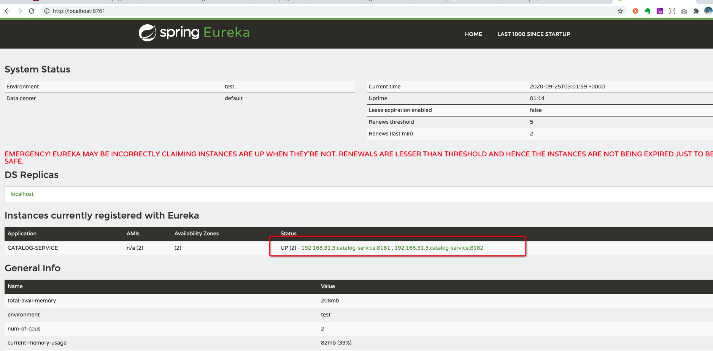
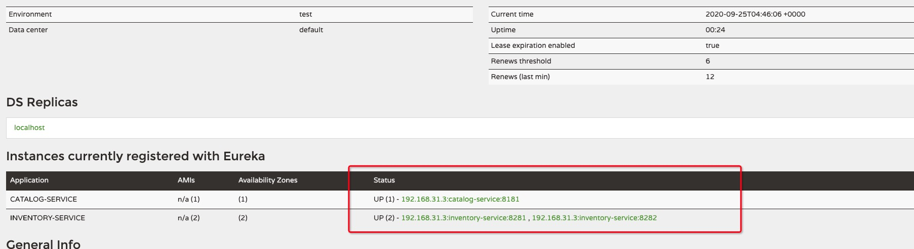
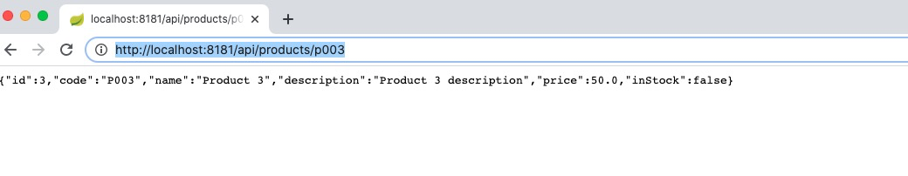

# Part3 Service Registry and Discovery

<!--https://www.sivalabs.in/2018/03/microservices-springcloud-eureka/-->

## 1 overview

> In the microservices world, Service Registry and Discovery plays an important role  
> because we most likely run multiple instances of services and we need a mechanism  
> to call other services without hardcoding their hostnames or port numbers.  
> In addition to that, in Cloud environments service instances may come up and go down anytime.  
> So we need some automatic service registration and discovery mechanism.  
> Spring Cloud provides Service Registry and Discovery features,  
> as usual, with multiple options. We can use Netflix Eureka or Consul for Service Registry and Discovery.  
> In this post, we will learn how to use SpringCloud Netflix Eureka for Service Registry and Discovery.


This post, we are going to learn:

* What is Service Registry and Discovery?
* Spring Cloud Netflix Eureka-based Service Registry
* Registering microservices as Eureka Clients
* Discovering other services using Eureka Client

为了加深对 eureka的理解 可以参考以下文章
* [Spring Cloud Eureka and Feign](README13_Spring_Cloud_Eureka.md)

## 2 What is Service Registry and Discovery?

> Suppose we have 2 microservices catalog-service and inventory-service  
> and we are running 2 instances of inventory-service at http://localhost:8181/  
> and http://localhost:8282/. Now let’s say we want to invoke some  
> inventory-service REST endpoint from catalog-service. Which URL should  
> we hit? Generally, in these scenarios,  we use a load balancer configuring  
> these 2 URLs to be delegated to  and we will invoke the REST endpoint  
> on load balancer URL. Fine.

> But, what if you want to spin up new instances dynamically based on load?  
> Even if you are going to run only few server nodes, manually updating  
> the server node details in load balancer configuration is error-prone  
> and tedious. This is why we need automatic Service Registration mechanism  
> and be able to invoke a service using some logical service id instead of  
> using specific IP Address and port numbers.

> We can use Netflix Eureka Server to create a Service Registry and make  
> our microservices as Eureka Clients so that as soon as we start a microservice  
> it will get registered with Eureka Server automatically with a logical Service ID.  
> Then, the other microservices, which are also Eureka Clients, can use Service ID  
> to invoke REST endpoints.

> Spring Cloud makes it very easy to create a Service Registry and  
> discovering other services using Load Balanced RestTemplate.


## 3 Spring Cloud Netflix Eureka based Service Registry

### 3.1 创建 Eureka Server项目

### 3.2 Eureka Server: 添加 pom依赖
```xml
<dependency>
    <groupId>org.springframework.cloud</groupId>
    <artifactId>spring-cloud-starter-netflix-eureka-server</artifactId>
</dependency>

```
### 3.3 Eureka Server: 创建启动项
```java
import org.springframework.boot.SpringApplication;
import org.springframework.boot.autoconfigure.SpringBootApplication;
import org.springframework.cloud.netflix.eureka.server.EnableEurekaServer;

@EnableEurekaServer
@SpringBootApplication
public class ServiceRegistryApplication {
    public static void main(String[] args) {
        SpringApplication.run(ServiceRegistryApplication.class, args);
    }
}
```

### 3.4 Eureka Server: 添加 application.properties 设置项
```properties
spring.application.name=service-registry
server.port=8761
eureka.instance.hostname=localhost
eureka.client.registerWithEureka=false
eureka.client.fetchRegistry=false
eureka.client.serviceUrl.defaultZone=http://${eureka.instance.hostname}:${server.port}/eureka/
eureka.instance.lease-renewal-interval-in-seconds=10
eureka.instance.prefer-ip-address=true
```
### 3.5 Eureka Server: 验证效果

启动项目
```shell script
java -jar -Dserver.port=8761 service-registry/target/service-registry.jar &
```

访问 http://localhost:8761



## 4 Registering microservices as Eureka Clients

创建 Eureka Client 并且注册到Eureka Server上

### 4.1 添加 eureka client的 pom 依赖
```xml
<dependency>
    <groupId>org.springframework.cloud</groupId>
    <artifactId>spring-cloud-starter-netflix-eureka-client</artifactId>
</dependency>
```

### 4.2 application.properties
```properties
eureka.client.service-url.defaultZone=http://localhost:8761/eureka/
```

### 4.3 java source

InventoryItem
```java
package com.thefirstwind.inventoryservice.entities;

import lombok.Data;

import javax.persistence.*;

@Data
@Entity
@Table(name="inventory")
public class InventoryItem {
    @Id
    @GeneratedValue(strategy = GenerationType.AUTO)
    private Long id;

    @Column(name="product_code", nullable = false, unique = true)
    private String productCode;

    @Column(name="quantity")
    private Integer availableQuantity = 0;

}

```

InventoryItemRepository
```java
package com.thefirstwind.inventoryservice.repositories;

import com.thefirstwind.inventoryservice.entities.InventoryItem;
import org.springframework.data.jpa.repository.JpaRepository;

import java.util.Optional;

public interface InventoryItemRepository extends JpaRepository<InventoryItem, Long> {

    Optional<InventoryItem> findByProductCode(String productCode);
}

```

InventoryController
```java
package com.thefirstwind.inventoryservice.web.controllers;

import com.thefirstwind.inventoryservice.entities.InventoryItem;
import com.thefirstwind.inventoryservice.repositories.InventoryItemRepository;
import lombok.extern.slf4j.Slf4j;
import org.springframework.beans.factory.annotation.Autowired;
import org.springframework.http.HttpStatus;
import org.springframework.http.ResponseEntity;
import org.springframework.web.bind.annotation.GetMapping;
import org.springframework.web.bind.annotation.PathVariable;
import org.springframework.web.bind.annotation.RestController;

import java.util.List;
import java.util.Optional;

@RestController
@Slf4j
public class InventoryController {

    private final InventoryItemRepository inventoryItemRepository;

    @Autowired
    public InventoryController(InventoryItemRepository inventoryItemRepository) {
        this.inventoryItemRepository = inventoryItemRepository;
    }

    @GetMapping("/api/inventory/{productCode}")
    public ResponseEntity<InventoryItem> findInventoryByProductCode(@PathVariable("productCode") String productCode){
        log.info("Finding inventory for product code :"+productCode);
        Optional<InventoryItem> inventoryItem = inventoryItemRepository.findByProductCode(productCode);
        if(inventoryItem.isPresent()){
            return new ResponseEntity(inventoryItem, HttpStatus.OK);
        }else{
            return new ResponseEntity(HttpStatus.NOT_FOUND);
        }
    }

    @GetMapping("/api/inventory")
    public List<InventoryItem> getInventory() {
        log.info("Finding inventory for all products ");
        return inventoryItemRepository.findAll();
    }

}

```

InventoryServiceApplication
```java
package com.thefirstwind.inventoryservice;

import org.springframework.boot.SpringApplication;
import org.springframework.boot.autoconfigure.SpringBootApplication;

@SpringBootApplication
public class InventoryServiceApplication {
    public static void main(String[] args) {
        SpringApplication.run(InventoryServiceApplication.class, args);
    }

}

```
### 4.3 build and run application

``` shell script
java -jar -Dserver.port=8181 catalog-service/target/catalog-service.jar &

java -jar -Dserver.port=8182 catalog-service/target/catalog-service.jar &

java -jar -Dserver.port=8281 inventory-service/target/inventory-service.jar &

java -jar -Dserver.port=8282 inventory-service/target/inventory-service.jar &
```



## 5 Discovering other services using Eureka Client

如何在 其他服务中 使用 Eureka Client

### 5.1 在 CatalogServiceApplication 中 添加 @LoadBalanced注解 的 RestTemplate
```java
@SpringBootApplication
public class CatalogServiceApplication {
 
    /**
     * 使用Ribbon LoadBalancer 访问 Eureka Fiegn Client
     * Ribbon LoadBalancer是客户端 负载均衡，所以那里调用 Eureak Client，就在哪里设置
     * @return 
     */
    @Bean
    @LoadBalanced
    public RestTemplate restTemplate() {
        return new RestTemplate();
    }
 
    public static void main(String[] args) {
        SpringApplication.run(CatalogServiceApplication.class, args);
    }
}

```

### 5.2 在catalog-service项目中 创建 ProductService 使用 RestTemplate 访问 Eureka Client
```java
package com.thefirstwind.catalogservice.services;

import com.thefirstwind.catalogservice.entities.Product;
import com.thefirstwind.catalogservice.repositories.ProductRepository;
import com.thefirstwind.catalogservice.web.models.ProductInventoryResponse;
import lombok.extern.slf4j.Slf4j;
import org.springframework.beans.factory.annotation.Autowired;
import org.springframework.http.HttpStatus;
import org.springframework.http.ResponseEntity;
import org.springframework.stereotype.Service;
import org.springframework.web.client.RestTemplate;

import javax.transaction.Transactional;
import java.util.List;
import java.util.Optional;

@Service
@Transactional
@Slf4j
public class ProductService {

    @Autowired
    private ProductRepository productRepository;

    @Autowired
    private RestTemplate restTemplate;

    public List<Product> findAllProducts(){
        return productRepository.findAll();
    }

    public Optional<Product> findProductByCode(String code){
        Optional<Product> productOptional = productRepository.findByCode(code);
        if(productOptional.isPresent()){
            log.info("Fetching inventory level for product_code:" + code);

            ResponseEntity<ProductInventoryResponse> itemResponseEntity =
                    restTemplate.getForEntity("http://inventory-service/api/inventory/{code}",
                            ProductInventoryResponse.class,
                            code);
            if(itemResponseEntity.getStatusCode() == HttpStatus.OK){
                Integer quantity = itemResponseEntity.getBody().getAvailableQuantity();
                log.info("Available quantity: " + quantity);
                productOptional.get().setInStock( quantity > 0);
            }else{
                log.error("Unable to get inventory level for product_code: " + code +
                        ", StatusCode: " + itemResponseEntity.getStatusCode());
            }
        }
        return productOptional;
    }
}

```

### 5.3 验证结果
创建一个 catalog-service 的 instance

创建两个 inventory-service 的 instance

在 catalog-service 中 使用 RestTemplate + Ribbon Loadbalance 随机访问 inventory-service

``` shell script
mvn clean install

docker-compose down 
docker-compose up --build

java -jar -Dserver.port=8181 catalog-service/target/catalog-service.jar &

java -jar -Dserver.port=8281 inventory-service/target/inventory-service.jar &

java -jar -Dserver.port=8282 inventory-service/target/inventory-service.jar &
```

这时候服务就注册上了



这里使用 http://inventory-service/api/inventory/{code} 来访问，而不是 http://localhost:8281/api/inventory/{code} or http://localhost:8282/api/inventory/{code}

另外外部验证 接口为 http://localhost:8181/api/products/p003



## Related Content
* [Part1 overview](README.md)
* [Part2 Spring Cloud Config and Vault](README02_Config_Vault.md)
* [Part3 Service Registry and Discovery]()
* [Part4 Circuit Breaker using Netflix Hystrix](README04_Circuit_Breaker.md)
* [Part5 Zuul Proxy as API Gateway](README05_API_Gateway.md)
* [Part6 Distributed Tracing with Sleuth and Zipkin](README06_Distributed_Tracing.md)

* [Spring cloud config server](README11_Spring_Cloud_Config_Server.md)
* [Spring cloud config client](README11_Spring_Cloud_Config_Client.md)
* [Spring cloud bus](README12_Spring_Cloud_Bus.md)
* [Spring Microservices Docker Example](https://github.com/thefirstwind/spring-microservices-docker-example/blob/master/README.md)
* [Spring Cloud Eureka and Feign](README13_Spring_Cloud_Eureka.md)
* [Netflix Hystrix How It Works](README14_Netflix_Hystrix_How_it_works.md)
* [Netflix Hystrix How to Use](README15_Netflix_Hystrix_How_To_Use.md)
* [Netflix Hystrix Configuration](README16_Netflix_Hystrix_Configuration.md)
* [Netflix Hystrix 原理和实战](REAME17_Nextfix_Hystrix_原理和实战.md)
