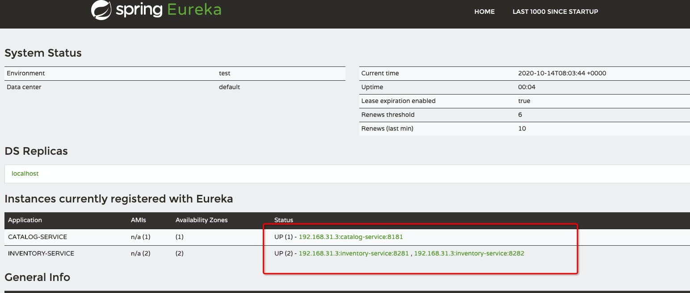
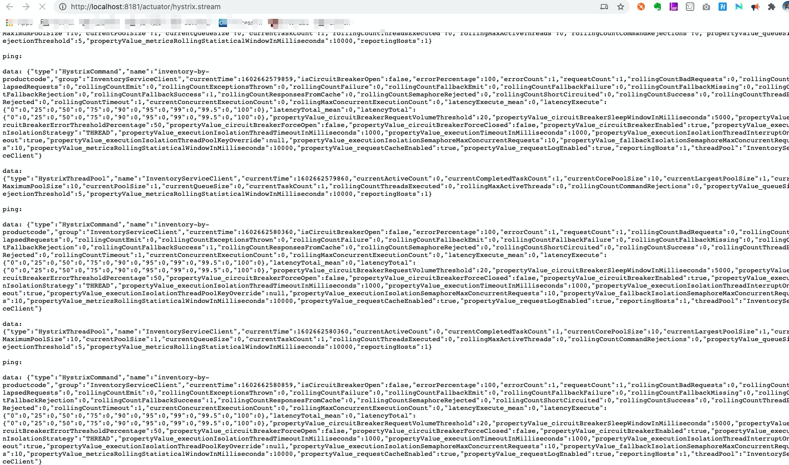
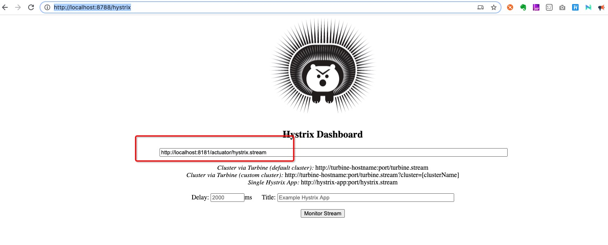

# Part4 Circuit Breaker using Netflix Hystrix

<!--https://www.sivalabs.in/2018/03/spring-cloud-netflix-circuit-breaker/-->

在微服务中，Netfix 创建了 Hystrix库，来实现 熔断机制，我们可以使用 Spring Cloud Netflix Hystrix Circuit Breaker来保护广播式的大流量导入造成的系统失败。

> In the microservices world, to fulfill a client request one microservice  
> may need to talk to other microservices. We should minimize this kind of  
> direct dependencies on other microservices but in some cases it is unavoidable.  
> If a microservice is down or not functioning properly then the issue may  
> cascade up to the upstream services. Netflix created Hystrix library  
> implementing Circuit Breaker pattern to address these kinds of issues.  
> We can use Spring Cloud Netflix Hystrix Circuit Breaker to protect  
> microservices from cascading failures.

In this post we are going to learn:
* Implementing Circuit Breaker pattern using @HystrixCommand
* How to propagate ThreadLocal variables
* Monitoring Circuit Breakers using Hystrix Dashboard


## 1 Implementing Netflix Hystrix Circuit Breaker pattern

> From catalog-service we are invoking REST endpoint on inventory-service  
> to get the inventory level of a product. What if inventory-service is  
> down? What if inventory-service is taking too long to respond thereby  
> slowing down all the services depending on it? We would like to have  
> some timeouts and implement some fallback mechanism.


### 1.1 修改 catalog-service的 pom.xml文件
```xml
<dependency>
    <groupId>org.springframework.cloud</groupId>
    <artifactId>spring-cloud-starter-netflix-hystrix</artifactId>
</dependency>
```

### 1.2 修改application文件
在 application启动文件中加入注释 @EnableCircuitBreaker
```java
package com.thefirstwind.catalogservice;

import org.springframework.boot.SpringApplication;
import org.springframework.boot.autoconfigure.SpringBootApplication;
import org.springframework.cloud.client.circuitbreaker.EnableCircuitBreaker;
import org.springframework.cloud.client.loadbalancer.LoadBalanced;
import org.springframework.context.annotation.Bean;
import org.springframework.web.client.RestTemplate;

@EnableCircuitBreaker
@SpringBootApplication
public class CatalogServiceApplication {

    @Bean
    @LoadBalanced
    public RestTemplate restTemplate() {
        return new RestTemplate();
    }


    public static void main(String[] args) {
        SpringApplication.run(CatalogServiceApplication.class, args);
    }
}

```
### 1.3 可以使用 @HystrixCommand 注解，应用在超时和回调方法中

> Now we can use @HystrixCommand annotation on any method we want to apply timeout and fallback method.
> Let us create InventoryServiceClient.java which will invoke inventory-service  
> REST endpoint and apply @HystrixCommand with a fallback implementation.


如下 创建 InventoryServiceClient.java 文件
```java
package com.thefirstwind.catalogservice.services;

import com.netflix.hystrix.contrib.javanica.annotation.HystrixCommand;
import com.netflix.hystrix.contrib.javanica.annotation.HystrixProperty;
import com.thefirstwind.catalogservice.web.models.ProductInventoryResponse;
import lombok.extern.slf4j.Slf4j;
import org.springframework.beans.factory.annotation.Autowired;
import org.springframework.http.HttpStatus;
import org.springframework.http.ResponseEntity;
import org.springframework.stereotype.Service;
import org.springframework.web.client.RestTemplate;

import java.util.Optional;

@Service
@Slf4j
public class InventoryServiceClient {

    private final RestTemplate restTemplate;

    @Autowired
    public InventoryServiceClient(RestTemplate restTemplate) {
        this.restTemplate = restTemplate;
    }

    @HystrixCommand(
            commandKey = "inventory-by-productcode"
            ,fallbackMethod = "getDefaultProductInventoryByCode"
//            ,commandProperties = {
//                @HystrixProperty(name="execution.isolation.thread.timeoutInMilliseconds", value="3000"),
//                @HystrixProperty(name="circuitBreaker.errorThresholdPercentage", value="60")
//            }
    )
    public Optional<ProductInventoryResponse> getProductInventoryByCode(String productCode){
        ResponseEntity<ProductInventoryResponse> itemResponseEntity =
                restTemplate.getForEntity("http://inventory-service/api/inventory/{code}",
                ProductInventoryResponse.class,
                productCode);
        if(itemResponseEntity.getStatusCode() == HttpStatus.OK){
            return Optional.ofNullable(itemResponseEntity.getBody());
        }else{
            log.error("Unable to get inventory level for product_code: " + productCode + ", StatusCode: " + itemResponseEntity.getStatusCode());
            return Optional.empty();
        }
    }

    public Optional<ProductInventoryResponse> getDefaultProductInventoryByCode(String productCode){
        log.info("Returning default ProductInventoryByCode for productCode: "+productCode);
        ProductInventoryResponse response = new ProductInventoryResponse();
        response.setProductCode(productCode);
        response.setAvailableQuantity(50);
        return Optional.ofNullable(response);
    }

}

```

> We have annotated the method from where we are making a REST call with  
> @HystrixCommand(fallbackMethod = “getDefaultProductInventoryByCode”)  
> so that if it doesn’t receive the response within the certain time limit  
> the call gets timed out and invoke the configured fallback method.  
> The fallback method should be defined in the same class and should have  
> the same signature. In the fallback method getDefaultProductInventoryByCode()  
> we are setting the availableQuantity to 50, obviously, this behavior  
> depends on what business wants.

> We can customize the @HystrixCommand default behavior by configuring  
> properties using @HystrixProperty annotations.

如下所示
```java
@HystrixCommand(fallbackMethod = "getDefaultProductInventoryByCode",
    commandProperties = {
       @HystrixProperty(name = "execution.isolation.thread.timeoutInMilliseconds", value = "3000"),
       @HystrixProperty(name = "circuitBreaker.errorThresholdPercentage", value="60")
    }
)
public Optional<ProductInventoryResponse> getProductInventoryByCode(String productCode)
{
    ....
}

```

同时，也可以设置到 bootstrap.properties/yml 文件中, 如下所示
```properties
hystrix.command.getProductInventoryByCode.execution.isolation.thread.timeoutInMilliseconds=2000
hystrix.command.getProductInventoryByCode.circuitBreaker.errorThresholdPercentage=60
```

另外还可以通过指定 commandKey 实现默认的行为，如下所示
```java
@HystrixCommand(commandKey = "inventory-by-productcode", fallbackMethod = "getDefaultProductInventoryByCode")
public Optional<ProductInventoryResponse> getProductInventoryByCode(String productCode)
{
    ...
}

```

## 2 How to propagate ThreadLocal variables
> By default, the methods with @HystrixCommand will be executed on a different thread because the default execution.isolation.strategy is ExecutionIsolationStrategy.THREAD. So, the ThreadLocal variables we set before invoking @HystrixCommand methods won’t be available within @HystrixCommand methods.

> One option to make the ThreadLocal variables available is using execution.isolation.strategy=SEMAPHORE.


## 3 Monitoring Circuit Breakers using Hystrix Dashboard
### 3.1  创建项目 hystrix-dashboard项目
### 3.2 在pom.xml中添加以下依赖
```xml
<dependency>
    <groupId>org.springframework.cloud</groupId>
    <artifactId>spring-cloud-starter-netflix-hystrix-dashboard</artifactId>
</dependency>

```
### 3.3 在application上添加 @EnableHystrixDashboard 注解
可以通过 http://localhost:8181/actuator/hystrix.stream 来监控


## 4 验证结果
创建一个 catalog-service 的 instance

创建两个 inventory-service 的 instance

在 catalog-service 中 使用 RestTemplate + Ribbon Loadbalance 随机访问 inventory-service

``` shell script
export JAVA_HOME=$JAVA_8_HOME
export PATH=$JAVA_HOME/bin:$PATH
mvn clean install

docker-compose down 
docker-compose up --build

java -jar -Dserver.port=8181 catalog-service/target/catalog-service.jar &

java -jar -Dserver.port=8281 inventory-service/target/inventory-service.jar &

java -jar -Dserver.port=8282 inventory-service/target/inventory-service.jar &
```

### 4.1 访问注册中心，确认服务已经注册上
http://localhost:8761/



### 4.2 访问 hystrix.stream 流的信息是否正常
http://localhost:8181/actuator/hystrix.stream



### 4.3 进入 hystrix dashboard
http://localhost:8788/hystrix



##  为了加深对hystrix的理解可以参考以下2篇文章
* [Netflix Hystrix How It Works](README14_Netflix_Hystrix_How_it_works.md)
* [Netflix Hystrix How to Use](README15_Netflix_Hystrix_How_To_Use.md)

## Related Content
* [Part1 overview](README.md)
* [Part2 Spring Cloud Config and Vault](README02_Config_Vault.md)
* [Part3 Service Registry and Discovery](README03_Registry_Discovery.md)
* [Part4 Circuit Breaker using Netflix Hystrix]()
* [Part5 Zuul Proxy as API Gateway](README05_API_Gateway.md)
* [Part6 Distributed Tracing with Sleuth and Zipkin](README06_Distributed_Tracing.md)

* [Spring cloud config server](README11_Spring_Cloud_Config_Server.md)
* [Spring cloud config client](README11_Spring_Cloud_Config_Client.md)
* [Spring cloud bus](README12_Spring_Cloud_Bus.md)
* [Spring Microservices Docker Example](https://github.com/thefirstwind/spring-microservices-docker-example/blob/master/README.md)
* [Spring Cloud Eureka and Feign](README13_Spring_Cloud_Eureka.md)
* [Netflix Hystrix How It Works](README14_Netflix_Hystrix_How_it_works.md)
* [Netflix Hystrix How to Use](README15_Netflix_Hystrix_How_To_Use.md)
* [Netflix Hystrix Configuration](README16_Netflix_Hystrix_Configuration.md)
* [Netflix Hystrix 原理和实战](REAME17_Nextfix_Hystrix_原理和实战.md)
