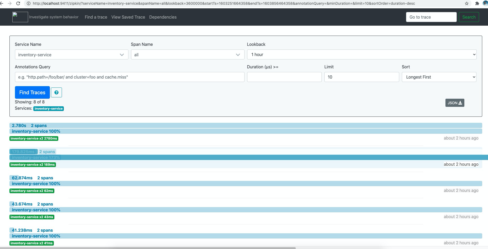

# Part6 Distributed Tracing with Sleuth and Zipkin

> One of the challenges in microservices architecture is the ability to  
> debug issues. A simple user action might trigger a chain of downstream  
> microservice calls. It would be tedious to trace the logs related to a  
> particular user action across microservices. In addition to that, we might  
> want to track down why a certain microservice call is taking so much time.  
> We can use Spring Cloud Sleuth to handle these kinds of issues. Spring Cloud  
> Sleuth provides the distributed tracing capabilities and we can also export  
> these trace information to Zipkin to visualize the call traces.

##  1 In this post we are going to learn:
* Tracing Distributed Service Calls
* Using Spring Cloud Sleuth for Distributed Tracing
* Distributed Tracing with Zipkin Server

## 2 Tracing Distributed Service Calls

In the microservices world, a user action on UI may invoke one microservice  
API endpoint, which in turn invoke another microservice endpoint.

For example, when a user sees the catalog, shoppingcart-ui will invoke  
catalog-service REST API http://localhost:8181/api/products which in turn  
calls inventory-service REST API http://localhost:8282/api/inventory to  
check for inventory availability.

Suppose, an exception has occurred or the data returned is invalid and  
you want to investigate what is wrong by looking at logs. But as of now,  
there is no way to correlate the logs of that particular user across  
multiple services.

## 3 Poor man’s distributed tracing

> One solution to this is at the beginning of the call chain we can create  
> a CORRELATION_ID and add it to all log statements. Along with it, send  
> CORRELATION_ID as a header to all the downstream services as well so that  
> those downstream services also use CORRELATION_ID in logs. This way we  
> can identify all the log statements related to a particular action across  
> services.

> We can implement this solution using MDC feature of Logging frameworks.  
> Typically we will have a WebRequest Interceptor where you can check whether  
> there is a CORRELATION_ID header. If there is no CORRELATION_ID in the  
> header then create a new one and set it in MDC. The logging frameworks  
> include the information set in MDC with all log statements.

> But, instead of we doing all this work we can use Spring Cloud Sleuth  
> which will do all this and much more for us.

## 4 Using Spring Cloud Sleuth for Distributed Tracing
添加pom依赖
```xml
<dependency>
    <groupId>org.springframework.cloud</groupId>
    <artifactId>spring-cloud-starter-sleuth</artifactId>
</dependency>

```

Once you add Sleuth starter and start the services you can observe in logs something like this.

```
2020-10-26 10:19:27.969  INFO [inventory-service,,,] 5673 --- [nio-8281-exec-1] o.s.web.servlet.DispatcherServlet        : FrameworkServlet 'dispatcherServlet': initialization completed in 159 ms
```

Now hit any inventory-service REST endpoint, say http://localhost:8282/api/inventory. Then you can observe TraceID, SpanID in the logs.

```
2020-10-26 10:19:29.025  INFO [inventory-service,4e7c680121366008,653cb3e0f5cc8162,false] 5673 --- [oryController-1] c.t.i.w.controllers.InventoryController  : Finding inventory for all products 
2020-10-26 10:19:29.137  INFO [inventory-service,4e7c680121366008,653cb3e0f5cc8162,false] 5673 --- [oryController-1] o.h.h.i.QueryTranslatorFactoryInitiator  : HHH000397: Using ASTQueryTranslatorFactory
Hibernate: select inventoryi0_.id as id1_0_, inventoryi0_.quantity as quantity2_0_, inventoryi0_.product_code as product_3_0_ from inventory inventoryi0_
2020-10-26 10:19:59.567  INFO [inventory-service,3dfb874856db121a,b7e5255217842ef0,false] 5673 --- [oryController-2] c.t.i.w.controllers.InventoryController  : Finding inventory for product code :P300
Hibernate: select inventoryi0_.id as id1_0_, inventoryi0_.quantity as quantity2_0_, inventoryi0_.product_code as product_3_0_ from inventory inventoryi0_ where inventoryi0_.product_code=?
```

The false in [inventory-service,4e7c680121366008,653cb3e0f5cc8162,false]  
indicates that this trace is not exported to any Tracing Server like Zipkin.  
Let us see how we can export the tracing information to Zipkin.


启动项目 并且确认
``` shell script
mvn clean install

docker-compose down
docker-compose up --build

java -jar -Dserver.port=8181 catalog-service/target/catalog-service.jar &

java -jar -Dserver.port=8281 inventory-service/target/inventory-service.jar &

java -jar -Dserver.port=8282 inventory-service/target/inventory-service.jar &

java -jar -Dserver.port=8080 shoppingcart-ui/target/shoppingcart-ui.jar &

```

```
http://localhost:8080/ui/api/catalog-service/api/products/getProductLimit
http://localhost:8080/ui/api/inventory-service/api/inventory
```


## 5 Distributed Tracing with Zipkin Server

> We learned how to use Sleuth to add tracing information in logs. In  
> addition to that, we can also export this information to Zipkin so that  
> we can visualize this through UI.


### 5.1 Zipkin Server using an executable jar
The quick and easiest way to start a Zipkin server is using zipkin executable jar provided by Zipkin team.

```shell script
cd zipkin-server
curl -sSL https://zipkin.io/quickstart.sh | bash -s
java -jar zipkin-server/zipkin.jar
```

This will start Zipkin server on port 9411 and you can access the Zipkin UI Dashboard at http://localhost:9411/zipkin/.

### 5.2 Zipkin Server as Docker container

### 5.3 Create Zipkin Server as SpringBoot application (NOT RECOMMENDED)

zipkin-server/src/main/java/com/thefirstwind/zipkinServer/ZipkinServerApplication.java
```java
package com.thefirstwind.zipkinServer;

import org.springframework.boot.SpringApplication;
import org.springframework.boot.autoconfigure.SpringBootApplication;
import zipkin.server.EnableZipkinServer;

@SpringBootApplication
@EnableZipkinServer
public class ZipkinServerApplication {
    public static void main(String[] args) {
        SpringApplication.run(ZipkinServerApplication.class, args);
    }
}

```
zipkin-server/src/main/resources/application.properties
```properties
spring.application.name=zipkin-server
server.port=9411
management.metrics.web.server.auto-time-requests=false

```

zipkin-server/pom.xml
```xml
<?xml version="1.0" encoding="UTF-8"?>
<project xmlns="http://maven.apache.org/POM/4.0.0"
         xmlns:xsi="http://www.w3.org/2001/XMLSchema-instance"
         xsi:schemaLocation="http://maven.apache.org/POM/4.0.0 http://maven.apache.org/xsd/maven-4.0.0.xsd">
    <modelVersion>4.0.0</modelVersion>

    <groupId>com.thefirstwind</groupId>
    <artifactId>zipkin-server</artifactId>
    <version>0.0.1-SNAPSHOT</version>
    <packaging>jar</packaging>

    <name>zipkin-service</name>
    <description>Demo project for Spring Boot</description>

    <parent>
        <groupId>org.springframework.boot</groupId>
        <artifactId>spring-boot-starter-parent</artifactId>
        <version>2.0.7.RELEASE</version>
        <relativePath/> <!-- lookup parent from repository -->
    </parent>


    <properties>
        <project.build.sourceEncoding>UTF-8</project.build.sourceEncoding>
        <project.reporting.outputEncoding>UTF-8</project.reporting.outputEncoding>
        <java.version>1.8</java.version>
        <spring-cloud.version>Finchley.M8</spring-cloud.version>
    </properties>

    <dependencies>
        <dependency>
            <groupId>org.springframework.boot</groupId>
            <artifactId>spring-boot-starter-web</artifactId>
        </dependency>
        <dependency>
            <groupId>io.zipkin.java</groupId>
            <artifactId>zipkin-server</artifactId>
            <version>2.11.7</version>
        </dependency>
        <dependency>
            <groupId>io.zipkin.java</groupId>
            <artifactId>zipkin-autoconfigure-ui</artifactId>
            <version>2.11.7</version>
        </dependency>
    </dependencies>

    <dependencyManagement>
        <dependencies>
            <dependency>
                <groupId>org.springframework.cloud</groupId>
                <artifactId>spring-cloud-dependencies</artifactId>
                <version>${spring-cloud.version}</version>
                <type>pom</type>
                <scope>import</scope>
            </dependency>
        </dependencies>
    </dependencyManagement>


    <build>
        <finalName>${project.artifactId}</finalName>
        <plugins>
            <plugin>
                <groupId>org.springframework.boot</groupId>
                <artifactId>spring-boot-maven-plugin</artifactId>
            </plugin>
            <plugin>
                <groupId>org.apache.maven.plugins</groupId>
                <artifactId>maven-surefire-plugin</artifactId>
                <configuration>
                    <skipTests>true</skipTests>
                </configuration>
            </plugin>
        </plugins>
    </build>
</project>
```

http://localhost:9411/zipkin/



```

```
## 6 Exporting tracing info to Zipkin Server

We observed that the tracing information is printed in logs but not exported. We can export them to Zipkin server so that we can visualize traces in Zipkin Server UI Dashboard.

Add Zipkin Client starter to both inventory-service and catalog-service.

```xml
<dependency>
    <groupId>org.springframework.cloud</groupId>
    <artifactId>spring-cloud-starter-zipkin</artifactId>
</dependency>
```

Configure Zipkin server URL in bootstrap.properties of both inventory-service and catalog-service.

```properties
spring.zipkin.base-url=http://localhost:9411/
spring.sleuth.sampler.probability=1
```


```
2020-10-26 11:49:16.845  INFO [inventory-service,a557e55735c3e3ed,bf4d1ec4af29acd8,true] 10265 --- [oryController-2] c.t.i.w.controllers.InventoryController  : Finding inventory for all products 
Hibernate: select inventoryi0_.id as id1_0_, inventoryi0_.quantity as quantity2_0_, inventoryi0_.product_code as product_3_0_ from inventory inventoryi0_
2020-10-26 11:49:20.637  INFO [inventory-service,7283ebe35a3c802b,d8c8ec65ed0bbce1,true] 10265 --- [oryController-3] c.t.i.w.controllers.InventoryController  : Finding inventory for all products 
Hibernate: select inventoryi0_.id as id1_0_, inventoryi0_.quantity as quantity2_0_, inventoryi0_.product_code as product_3_0_ from inventory inventoryi0_
```
## Related Content
* [Part1 overview](README.md)
* [Part2 Spring Cloud Config and Vault](README02_Config_Vault.md)
* [Part3 Service Registry and Discovery](README03_Registry_Discovery.md)
* [Part4 Circuit Breaker using Netflix Hystrix](README04_Circuit_Breaker.md)
* [Part5 Zuul Proxy as API Gateway](README05_API_Gateway.md)
* [Part6 Distributed Tracing with Sleuth and Zipkin]()

* [Spring cloud config server](README11_Spring_Cloud_Config_Server.md)
* [Spring cloud config client](README11_Spring_Cloud_Config_Client.md)
* [Spring cloud bus](README12_Spring_Cloud_Bus.md)
* [Spring Microservices Docker Example](https://github.com/thefirstwind/spring-microservices-docker-example/blob/master/README.md)
* [Spring Cloud Eureka and Feign](README13_Spring_Cloud_Eureka.md)
* [Netflix Hystrix How It Works](README14_Netflix_Hystrix_How_it_works.md)
* [Netflix Hystrix How to Use](README15_Netflix_Hystrix_How_To_Use.md)
* [Netflix Hystrix Configuration](README16_Netflix_Hystrix_Configuration.md)
* [Netflix Hystrix 原理和实战](REAME17_Nextfix_Hystrix_原理和实战.md)
