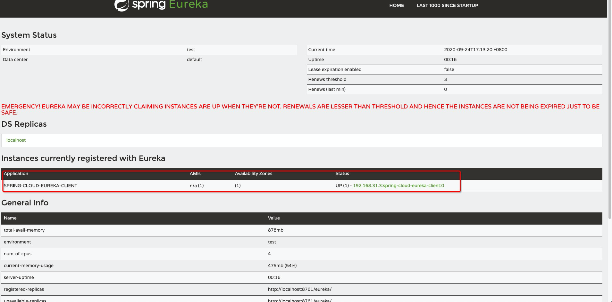
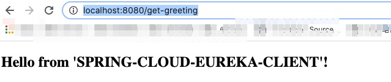
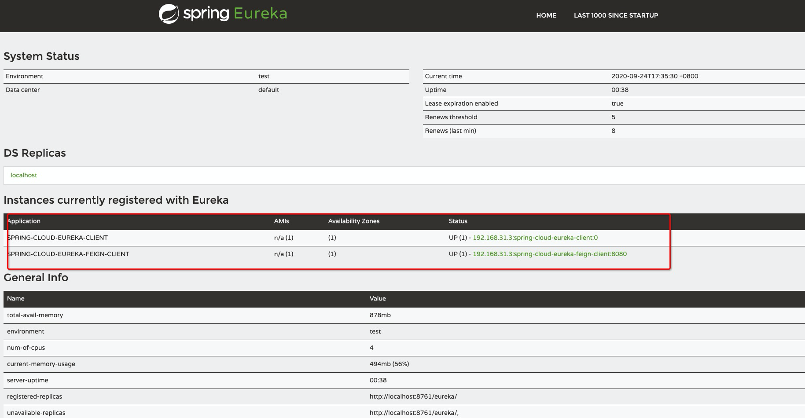

# spring cloud eureka

## overview
本文设计3个项目
* 1 spring-cloud-eureka-server : 注册中心
* 2 spring-cloud-eureka-client : 注册客户端
* 3 spring-cloud-eureka-feign-client : 注册客户端 使用 feign实现，用到 2的项目

项目目录：
* https://github.com/thefirstwind/springcloud-series/tree/master/spring-cloud-eureka-server
* https://github.com/thefirstwind/springcloud-series/tree/master/spring-cloud-eureka-client
* https://github.com/thefirstwind/springcloud-series/tree/master/spring-cloud-eureka-feign-client

## 1 创建项目 spring-cloud-eureka-server

### 1.1 添加 pom.xml 依赖
```xml
<dependency>
    <groupId>org.springframework.cloud</groupId>
    <artifactId>spring-cloud-starter-netflix-eureka-server</artifactId>
</dependency>
```
### 1.2 创建 application.java
```java
package com.thefirstwind.eurekaServer;

import org.springframework.boot.SpringApplication;
import org.springframework.boot.autoconfigure.SpringBootApplication;
import org.springframework.cloud.netflix.eureka.server.EnableEurekaServer;

@SpringBootApplication
@EnableEurekaServer
public class EurekaServerApplication {
    public static void main(String[] args) {
        SpringApplication.run(EurekaServerApplication.class, args);
    }

}

```
### 1.3 创建 application.yml
```yaml
server:
  port: 8761
eureka:
  client:
    registerWithEureka: false
    fetchRegistry: false
```

### 1.4 启动项目

```shell script
cd spring-cloud-eureka-server
mvn spring-boot:run
```

```
2020-09-24 16:56:58.180  INFO 34651 --- [           main] s.c.a.AnnotationConfigApplicationContext : Refreshing org.springframework.context.annotation.AnnotationConfigApplicationContext@57332cd6: startup date [Thu Sep 24 16:56:58 CST 2020]; root of context hierarchy
2020-09-24 16:56:59.760  INFO 34651 --- [           main] f.a.AutowiredAnnotationBeanPostProcessor : JSR-330 'javax.inject.Inject' annotation found and supported for autowiring
2020-09-24 16:57:00.065  INFO 34651 --- [           main] trationDelegate$BeanPostProcessorChecker : Bean 'configurationPropertiesRebinderAutoConfiguration' of type [org.springframework.cloud.autoconfigure.ConfigurationPropertiesRebinderAutoConfiguration$$EnhancerBySpringCGLIB$$c6edcaa6] is not eligible for getting processed by all BeanPostProcessors (for example: not eligible for auto-proxying)

  .   ____          _            __ _ _
 /\\ / ___'_ __ _ _(_)_ __  __ _ \ \ \ \
( ( )\___ | '_ | '_| | '_ \/ _` | \ \ \ \
 \\/  ___)| |_)| | | | | || (_| |  ) ) ) )
  '  |____| .__|_| |_|_| |_\__, | / / / /
 =========|_|==============|___/=/_/_/_/
 :: Spring Boot ::        (v2.0.0.RELEASE)

2020-09-24 16:57:01.478  INFO 34651 --- [           main] c.t.e.EurekaServerApplication            : No active profile set, falling back to default profiles: default
2020-09-24 16:57:01.564  INFO 34651 --- [           main] ConfigServletWebServerApplicationContext : Refreshing org.springframework.boot.web.servlet.context.AnnotationConfigServletWebServerApplicationContext@4bd46bce: startup date [Thu Sep 24 16:57:01 CST 2020]; parent: org.springframework.context.annotation.AnnotationConfigApplicationContext@57332cd6
2020-09-24 16:57:04.153  INFO 34651 --- [           main] o.s.b.f.s.DefaultListableBeanFactory     : Overriding bean definition for bean 'environmentWebEndpointExtension' with a different definition: replacing [Root bean: class [null]; scope=; abstract=false; lazyInit=false; autowireMode=3; dependencyCheck=0; autowireCandidate=true; primary=false; factoryBeanName=org.springframework.boot.actuate.autoconfigure.env.EnvironmentEndpointAutoConfiguration; factoryMethodName=environmentWebEndpointExtension; initMethodName=null; destroyMethodName=(inferred); defined in class path resource [org/springframework/boot/actuate/autoconfigure/env/EnvironmentEndpointAutoConfiguration.class]] with [Root bean: class [null]; scope=; abstract=false; lazyInit=false; autowireMode=3; dependencyCheck=0; autowireCandidate=true; primary=false; factoryBeanName=org.springframework.cloud.autoconfigure.LifecycleMvcEndpointAutoConfiguration$EndpointConfiguration; factoryMethodName=environmentWebEndpointExtension; initMethodName=null; destroyMethodName=(inferred); defined in class path resource [org/springframework/cloud/autoconfigure/LifecycleMvcEndpointAutoConfiguration$EndpointConfiguration.class]]
2020-09-24 16:57:06.291  INFO 34651 --- [           main] o.s.cloud.context.scope.GenericScope     : BeanFactory id=107e5e83-f1f6-3eb2-a294-6ef0976d89ea
2020-09-24 16:57:06.385  INFO 34651 --- [           main] f.a.AutowiredAnnotationBeanPostProcessor : JSR-330 'javax.inject.Inject' annotation found and supported for autowiring
2020-09-24 16:57:06.715  INFO 34651 --- [           main] trationDelegate$BeanPostProcessorChecker : Bean 'org.springframework.cloud.autoconfigure.ConfigurationPropertiesRebinderAutoConfiguration' of type [org.springframework.cloud.autoconfigure.ConfigurationPropertiesRebinderAutoConfiguration$$EnhancerBySpringCGLIB$$c6edcaa6] is not eligible for getting processed by all BeanPostProcessors (for example: not eligible for auto-proxying)
2020-09-24 16:57:07.895  INFO 34651 --- [           main] o.s.b.w.embedded.tomcat.TomcatWebServer  : Tomcat initialized with port(s): 8761 (http)
2020-09-24 16:57:08.007  INFO 34651 --- [           main] o.apache.catalina.core.StandardService   : Starting service [Tomcat]
2020-09-24 16:57:08.008  INFO 34651 --- [           main] org.apache.catalina.core.StandardEngine  : Starting Servlet Engine: Apache Tomcat/8.5.28
2020-09-24 16:57:08.026  INFO 34651 --- [ost-startStop-1] o.a.catalina.core.AprLifecycleListener   : The APR based Apache Tomcat Native library which allows optimal performance in production environments was not found on the java.library.path: [/Users/xingxn/Library/Java/Extensions:/Library/Java/Extensions:/Network/Library/Java/Extensions:/System/Library/Java/Extensions:/usr/lib/java:.]
2020-09-24 16:57:08.212  INFO 34651 --- [ost-startStop-1] o.a.c.c.C.[Tomcat].[localhost].[/]       : Initializing Spring embedded WebApplicationContext
2020-09-24 16:57:08.213  INFO 34651 --- [ost-startStop-1] o.s.web.context.ContextLoader            : Root WebApplicationContext: initialization completed in 6649 ms
2020-09-24 16:57:12.153  INFO 34651 --- [ost-startStop-1] o.s.b.w.servlet.FilterRegistrationBean   : Mapping filter: 'characterEncodingFilter' to: [/*]
2020-09-24 16:57:12.155  INFO 34651 --- [ost-startStop-1] o.s.b.w.servlet.FilterRegistrationBean   : Mapping filter: 'hiddenHttpMethodFilter' to: [/*]
2020-09-24 16:57:12.155  INFO 34651 --- [ost-startStop-1] o.s.b.w.servlet.FilterRegistrationBean   : Mapping filter: 'httpPutFormContentFilter' to: [/*]
2020-09-24 16:57:12.155  INFO 34651 --- [ost-startStop-1] o.s.b.w.servlet.FilterRegistrationBean   : Mapping filter: 'requestContextFilter' to: [/*]
2020-09-24 16:57:12.156  INFO 34651 --- [ost-startStop-1] o.s.b.w.servlet.FilterRegistrationBean   : Mapping filter: 'httpTraceFilter' to: [/*]
2020-09-24 16:57:12.156  INFO 34651 --- [ost-startStop-1] o.s.b.w.servlet.FilterRegistrationBean   : Mapping filter: 'webMvcMetricsFilter' to: [/*]
2020-09-24 16:57:12.156  INFO 34651 --- [ost-startStop-1] o.s.b.w.servlet.FilterRegistrationBean   : Mapping filter: 'servletContainer' to urls: [/eureka/*]
2020-09-24 16:57:12.156  INFO 34651 --- [ost-startStop-1] o.s.b.w.servlet.ServletRegistrationBean  : Servlet dispatcherServlet mapped to [/]
2020-09-24 16:57:12.295  INFO 34651 --- [ost-startStop-1] c.s.j.s.i.a.WebApplicationImpl           : Initiating Jersey application, version 'Jersey: 1.19.1 03/11/2016 02:08 PM'
2020-09-24 16:57:12.384  INFO 34651 --- [ost-startStop-1] c.n.d.provider.DiscoveryJerseyProvider   : Using JSON encoding codec LegacyJacksonJson
2020-09-24 16:57:12.385  INFO 34651 --- [ost-startStop-1] c.n.d.provider.DiscoveryJerseyProvider   : Using JSON decoding codec LegacyJacksonJson
2020-09-24 16:57:12.532  INFO 34651 --- [ost-startStop-1] c.n.d.provider.DiscoveryJerseyProvider   : Using XML encoding codec XStreamXml
2020-09-24 16:57:12.532  INFO 34651 --- [ost-startStop-1] c.n.d.provider.DiscoveryJerseyProvider   : Using XML decoding codec XStreamXml
2020-09-24 16:57:13.069  WARN 34651 --- [           main] o.s.c.n.a.ArchaiusAutoConfiguration      : No spring.application.name found, defaulting to 'application'
2020-09-24 16:57:13.075  WARN 34651 --- [           main] c.n.c.sources.URLConfigurationSource     : No URLs will be polled as dynamic configuration sources.
2020-09-24 16:57:13.075  INFO 34651 --- [           main] c.n.c.sources.URLConfigurationSource     : To enable URLs as dynamic configuration sources, define System property archaius.configurationSource.additionalUrls or make config.properties available on classpath.
2020-09-24 16:57:13.085  WARN 34651 --- [           main] c.n.c.sources.URLConfigurationSource     : No URLs will be polled as dynamic configuration sources.
2020-09-24 16:57:13.085  INFO 34651 --- [           main] c.n.c.sources.URLConfigurationSource     : To enable URLs as dynamic configuration sources, define System property archaius.configurationSource.additionalUrls or make config.properties available on classpath.
2020-09-24 16:57:13.360  INFO 34651 --- [           main] s.w.s.m.m.a.RequestMappingHandlerAdapter : Looking for @ControllerAdvice: org.springframework.boot.web.servlet.context.AnnotationConfigServletWebServerApplicationContext@4bd46bce: startup date [Thu Sep 24 16:57:01 CST 2020]; parent: org.springframework.context.annotation.AnnotationConfigApplicationContext@57332cd6
2020-09-24 16:57:13.783  INFO 34651 --- [           main] s.w.s.m.m.a.RequestMappingHandlerMapping : Mapped "{[/error]}" onto public org.springframework.http.ResponseEntity<java.util.Map<java.lang.String, java.lang.Object>> org.springframework.boot.autoconfigure.web.servlet.error.BasicErrorController.error(javax.servlet.http.HttpServletRequest)
2020-09-24 16:57:13.785  INFO 34651 --- [           main] s.w.s.m.m.a.RequestMappingHandlerMapping : Mapped "{[/error],produces=[text/html]}" onto public org.springframework.web.servlet.ModelAndView org.springframework.boot.autoconfigure.web.servlet.error.BasicErrorController.errorHtml(javax.servlet.http.HttpServletRequest,javax.servlet.http.HttpServletResponse)
2020-09-24 16:57:13.793  INFO 34651 --- [           main] s.w.s.m.m.a.RequestMappingHandlerMapping : Mapped "{[/],methods=[GET]}" onto public java.lang.String org.springframework.cloud.netflix.eureka.server.EurekaController.status(javax.servlet.http.HttpServletRequest,java.util.Map<java.lang.String, java.lang.Object>)
2020-09-24 16:57:13.794  INFO 34651 --- [           main] s.w.s.m.m.a.RequestMappingHandlerMapping : Mapped "{[/lastn],methods=[GET]}" onto public java.lang.String org.springframework.cloud.netflix.eureka.server.EurekaController.lastn(javax.servlet.http.HttpServletRequest,java.util.Map<java.lang.String, java.lang.Object>)
2020-09-24 16:57:13.850  INFO 34651 --- [           main] o.s.w.s.handler.SimpleUrlHandlerMapping  : Mapped URL path [/webjars/**] onto handler of type [class org.springframework.web.servlet.resource.ResourceHttpRequestHandler]
2020-09-24 16:57:13.850  INFO 34651 --- [           main] o.s.w.s.handler.SimpleUrlHandlerMapping  : Mapped URL path [/**] onto handler of type [class org.springframework.web.servlet.resource.ResourceHttpRequestHandler]
2020-09-24 16:57:13.923  INFO 34651 --- [           main] o.s.w.s.handler.SimpleUrlHandlerMapping  : Mapped URL path [/**/favicon.ico] onto handler of type [class org.springframework.web.servlet.resource.ResourceHttpRequestHandler]
2020-09-24 16:57:14.427  INFO 34651 --- [           main] o.s.ui.freemarker.SpringTemplateLoader   : SpringTemplateLoader for FreeMarker: using resource loader [org.springframework.boot.web.servlet.context.AnnotationConfigServletWebServerApplicationContext@4bd46bce: startup date [Thu Sep 24 16:57:01 CST 2020]; parent: org.springframework.context.annotation.AnnotationConfigApplicationContext@57332cd6] and template loader path [classpath:/templates/]
2020-09-24 16:57:14.429  INFO 34651 --- [           main] o.s.w.s.v.f.FreeMarkerConfigurer         : ClassTemplateLoader for Spring macros added to FreeMarker configuration
2020-09-24 16:57:14.662  INFO 34651 --- [           main] o.s.c.n.eureka.InstanceInfoFactory       : Setting initial instance status as: STARTING
2020-09-24 16:57:14.721  INFO 34651 --- [           main] com.netflix.discovery.DiscoveryClient    : Initializing Eureka in region us-east-1
2020-09-24 16:57:14.722  INFO 34651 --- [           main] com.netflix.discovery.DiscoveryClient    : Client configured to neither register nor query for data.
2020-09-24 16:57:14.742  INFO 34651 --- [           main] com.netflix.discovery.DiscoveryClient    : Discovery Client initialized at timestamp 1600937834738 with initial instances count: 0
2020-09-24 16:57:14.833  INFO 34651 --- [           main] c.n.eureka.DefaultEurekaServerContext    : Initializing ...
2020-09-24 16:57:14.836  INFO 34651 --- [           main] c.n.eureka.cluster.PeerEurekaNodes       : Adding new peer nodes [http://localhost:8761/eureka/]
2020-09-24 16:57:15.170  INFO 34651 --- [           main] c.n.d.provider.DiscoveryJerseyProvider   : Using JSON encoding codec LegacyJacksonJson
2020-09-24 16:57:15.170  INFO 34651 --- [           main] c.n.d.provider.DiscoveryJerseyProvider   : Using JSON decoding codec LegacyJacksonJson
2020-09-24 16:57:15.170  INFO 34651 --- [           main] c.n.d.provider.DiscoveryJerseyProvider   : Using XML encoding codec XStreamXml
2020-09-24 16:57:15.170  INFO 34651 --- [           main] c.n.d.provider.DiscoveryJerseyProvider   : Using XML decoding codec XStreamXml
2020-09-24 16:57:15.375  INFO 34651 --- [           main] c.n.eureka.cluster.PeerEurekaNodes       : Replica node URL:  http://localhost:8761/eureka/
2020-09-24 16:57:15.388  INFO 34651 --- [           main] c.n.e.registry.AbstractInstanceRegistry  : Finished initializing remote region registries. All known remote regions: []
2020-09-24 16:57:15.389  INFO 34651 --- [           main] c.n.eureka.DefaultEurekaServerContext    : Initialized
2020-09-24 16:57:15.559  INFO 34651 --- [           main] s.b.a.e.w.s.WebMvcEndpointHandlerMapping : Mapped "{[/actuator/health],methods=[GET],produces=[application/vnd.spring-boot.actuator.v2+json || application/json]}" onto public java.lang.Object org.springframework.boot.actuate.endpoint.web.servlet.AbstractWebMvcEndpointHandlerMapping$OperationHandler.handle(javax.servlet.http.HttpServletRequest,java.util.Map<java.lang.String, java.lang.String>)
2020-09-24 16:57:15.564  INFO 34651 --- [           main] s.b.a.e.w.s.WebMvcEndpointHandlerMapping : Mapped "{[/actuator/info],methods=[GET],produces=[application/vnd.spring-boot.actuator.v2+json || application/json]}" onto public java.lang.Object org.springframework.boot.actuate.endpoint.web.servlet.AbstractWebMvcEndpointHandlerMapping$OperationHandler.handle(javax.servlet.http.HttpServletRequest,java.util.Map<java.lang.String, java.lang.String>)
2020-09-24 16:57:15.566  INFO 34651 --- [           main] s.b.a.e.w.s.WebMvcEndpointHandlerMapping : Mapped "{[/actuator],methods=[GET],produces=[application/vnd.spring-boot.actuator.v2+json || application/json]}" onto protected java.util.Map<java.lang.String, java.util.Map<java.lang.String, org.springframework.boot.actuate.endpoint.web.Link>> org.springframework.boot.actuate.endpoint.web.servlet.WebMvcEndpointHandlerMapping.links(javax.servlet.http.HttpServletRequest,javax.servlet.http.HttpServletResponse)
2020-09-24 16:57:15.747  INFO 34651 --- [           main] o.s.j.e.a.AnnotationMBeanExporter        : Registering beans for JMX exposure on startup
2020-09-24 16:57:15.778  INFO 34651 --- [           main] o.s.j.e.a.AnnotationMBeanExporter        : Bean with name 'configurationPropertiesRebinder' has been autodetected for JMX exposure
2020-09-24 16:57:15.782  INFO 34651 --- [           main] o.s.j.e.a.AnnotationMBeanExporter        : Bean with name 'environmentManager' has been autodetected for JMX exposure
2020-09-24 16:57:15.786  INFO 34651 --- [           main] o.s.j.e.a.AnnotationMBeanExporter        : Bean with name 'refreshScope' has been autodetected for JMX exposure
2020-09-24 16:57:15.794  INFO 34651 --- [           main] o.s.j.e.a.AnnotationMBeanExporter        : Located managed bean 'environmentManager': registering with JMX server as MBean [org.springframework.cloud.context.environment:name=environmentManager,type=EnvironmentManager]
2020-09-24 16:57:15.811  INFO 34651 --- [           main] o.s.j.e.a.AnnotationMBeanExporter        : Located managed bean 'refreshScope': registering with JMX server as MBean [org.springframework.cloud.context.scope.refresh:name=refreshScope,type=RefreshScope]
2020-09-24 16:57:15.838  INFO 34651 --- [           main] o.s.j.e.a.AnnotationMBeanExporter        : Located managed bean 'configurationPropertiesRebinder': registering with JMX server as MBean [org.springframework.cloud.context.properties:name=configurationPropertiesRebinder,context=4bd46bce,type=ConfigurationPropertiesRebinder]
2020-09-24 16:57:15.868  INFO 34651 --- [           main] o.s.c.support.DefaultLifecycleProcessor  : Starting beans in phase 0
2020-09-24 16:57:15.869  INFO 34651 --- [           main] o.s.c.n.e.s.EurekaServiceRegistry        : Registering application unknown with eureka with status UP
2020-09-24 16:57:15.881  INFO 34651 --- [      Thread-13] o.s.c.n.e.server.EurekaServerBootstrap   : Setting the eureka configuration..
2020-09-24 16:57:15.883  INFO 34651 --- [      Thread-13] o.s.c.n.e.server.EurekaServerBootstrap   : Eureka data center value eureka.datacenter is not set, defaulting to default
2020-09-24 16:57:15.884  INFO 34651 --- [      Thread-13] o.s.c.n.e.server.EurekaServerBootstrap   : Eureka environment value eureka.environment is not set, defaulting to test
2020-09-24 16:57:15.899  INFO 34651 --- [      Thread-13] o.s.c.n.e.server.EurekaServerBootstrap   : isAws returned false
2020-09-24 16:57:15.900  INFO 34651 --- [      Thread-13] o.s.c.n.e.server.EurekaServerBootstrap   : Initialized server context
2020-09-24 16:57:15.900  INFO 34651 --- [      Thread-13] c.n.e.r.PeerAwareInstanceRegistryImpl    : Got 1 instances from neighboring DS node
2020-09-24 16:57:15.900  INFO 34651 --- [      Thread-13] c.n.e.r.PeerAwareInstanceRegistryImpl    : Renew threshold is: 1
2020-09-24 16:57:15.900  INFO 34651 --- [      Thread-13] c.n.e.r.PeerAwareInstanceRegistryImpl    : Changing status to UP
2020-09-24 16:57:15.915  INFO 34651 --- [      Thread-13] e.s.EurekaServerInitializerConfiguration : Started Eureka Server
2020-09-24 16:57:16.008  INFO 34651 --- [           main] o.s.b.w.embedded.tomcat.TomcatWebServer  : Tomcat started on port(s): 8761 (http) with context path ''
2020-09-24 16:57:16.010  INFO 34651 --- [           main] .s.c.n.e.s.EurekaAutoServiceRegistration : Updating port to 8761
2020-09-24 16:57:16.013  INFO 34651 --- [           main] c.t.e.EurekaServerApplication            : Started EurekaServerApplication in 19.712 seconds (JVM running for 28.603)

```

访问地址 http://localhost:8761


## 2 创建项目 spring-cloud-eureka-client

## 2.1 添加 pom.xml 依赖
```xml
<dependency>
    <groupId>org.springframework.cloud</groupId>
    <artifactId>spring-cloud-starter-netflix-eureka-client</artifactId>
</dependency>
```
## 2.2 创建 application.java
```java
package com.thefirstwind.eurekaClient;

import com.netflix.discovery.EurekaClient;
import org.springframework.beans.factory.annotation.Autowired;
import org.springframework.beans.factory.annotation.Value;
import org.springframework.boot.SpringApplication;
import org.springframework.boot.autoconfigure.SpringBootApplication;
import org.springframework.context.annotation.Lazy;
import org.springframework.web.bind.annotation.RequestMapping;
import org.springframework.web.bind.annotation.RestController;

@SpringBootApplication
@RestController
public class EurekaClientApplication {

    @Autowired
    @Lazy
    private EurekaClient eurekaClient;

    @Value("${spring.application.name}")
    private String appName;

    public static void main(String[] args) {
        SpringApplication.run(EurekaClientApplication.class, args);
    }

    @RequestMapping("/greeting")
    public String greeting() {
        return String.format(
                "Hello from '%s'!", eurekaClient.getApplication(appName).getName());
    }

}

```
## 2.3 创建 application.yml
```yaml
spring:
  application:
    name: spring-cloud-eureka-client
server:
  port: 0
eureka:
  client:
    serviceUrl:
      defaultZone: ${EUREKA_URI:http://localhost:8761/eureka}
  instance:
    preferIpAddress: true

```

### 2.4 启动项目

```shell script
cd spring-cloud-eureka-client
mvn spring-boot:run
```

```
2020-09-24 17:12:50.317  INFO 35621 --- [           main] s.c.a.AnnotationConfigApplicationContext : Refreshing org.springframework.context.annotation.AnnotationConfigApplicationContext@143a09e5: startup date [Thu Sep 24 17:12:50 CST 2020]; root of context hierarchy
2020-09-24 17:12:50.979  INFO 35621 --- [           main] f.a.AutowiredAnnotationBeanPostProcessor : JSR-330 'javax.inject.Inject' annotation found and supported for autowiring
2020-09-24 17:12:51.100  INFO 35621 --- [           main] trationDelegate$BeanPostProcessorChecker : Bean 'configurationPropertiesRebinderAutoConfiguration' of type [org.springframework.cloud.autoconfigure.ConfigurationPropertiesRebinderAutoConfiguration$$EnhancerBySpringCGLIB$$b538e1d4] is not eligible for getting processed by all BeanPostProcessors (for example: not eligible for auto-proxying)

  .   ____          _            __ _ _
 /\\ / ___'_ __ _ _(_)_ __  __ _ \ \ \ \
( ( )\___ | '_ | '_| | '_ \/ _` | \ \ \ \
 \\/  ___)| |_)| | | | | || (_| |  ) ) ) )
  '  |____| .__|_| |_|_| |_\__, | / / / /
 =========|_|==============|___/=/_/_/_/
 :: Spring Boot ::        (v2.0.0.RELEASE)

2020-09-24 17:12:51.439  INFO 35621 --- [           main] c.t.e.EurekaClientApplication            : No active profile set, falling back to default profiles: default
2020-09-24 17:12:51.486  INFO 35621 --- [           main] ConfigServletWebServerApplicationContext : Refreshing org.springframework.boot.web.servlet.context.AnnotationConfigServletWebServerApplicationContext@6e4ec20: startup date [Thu Sep 24 17:12:51 CST 2020]; parent: org.springframework.context.annotation.AnnotationConfigApplicationContext@143a09e5
2020-09-24 17:12:52.352  INFO 35621 --- [           main] o.s.cloud.context.scope.GenericScope     : BeanFactory id=a45ee373-8d9d-3366-a0b5-63ca61fe8113
2020-09-24 17:12:52.391  INFO 35621 --- [           main] f.a.AutowiredAnnotationBeanPostProcessor : JSR-330 'javax.inject.Inject' annotation found and supported for autowiring
2020-09-24 17:12:52.540  INFO 35621 --- [           main] trationDelegate$BeanPostProcessorChecker : Bean 'org.springframework.cloud.autoconfigure.ConfigurationPropertiesRebinderAutoConfiguration' of type [org.springframework.cloud.autoconfigure.ConfigurationPropertiesRebinderAutoConfiguration$$EnhancerBySpringCGLIB$$b538e1d4] is not eligible for getting processed by all BeanPostProcessors (for example: not eligible for auto-proxying)
2020-09-24 17:12:52.901  INFO 35621 --- [           main] o.s.b.w.embedded.tomcat.TomcatWebServer  : Tomcat initialized with port(s): 0 (http)
2020-09-24 17:12:52.961  INFO 35621 --- [           main] o.apache.catalina.core.StandardService   : Starting service [Tomcat]
2020-09-24 17:12:52.962  INFO 35621 --- [           main] org.apache.catalina.core.StandardEngine  : Starting Servlet Engine: Apache Tomcat/8.5.28
2020-09-24 17:12:52.976  INFO 35621 --- [ost-startStop-1] o.a.catalina.core.AprLifecycleListener   : The APR based Apache Tomcat Native library which allows optimal performance in production environments was not found on the java.library.path: [/Users/xingxn/Library/Java/Extensions:/Library/Java/Extensions:/Network/Library/Java/Extensions:/System/Library/Java/Extensions:/usr/lib/java:.]
2020-09-24 17:12:53.115  INFO 35621 --- [ost-startStop-1] o.a.c.c.C.[Tomcat].[localhost].[/]       : Initializing Spring embedded WebApplicationContext
2020-09-24 17:12:53.115  INFO 35621 --- [ost-startStop-1] o.s.web.context.ContextLoader            : Root WebApplicationContext: initialization completed in 1629 ms
2020-09-24 17:12:53.316  INFO 35621 --- [ost-startStop-1] o.s.b.w.servlet.ServletRegistrationBean  : Servlet dispatcherServlet mapped to [/]
2020-09-24 17:12:53.322  INFO 35621 --- [ost-startStop-1] o.s.b.w.servlet.FilterRegistrationBean   : Mapping filter: 'characterEncodingFilter' to: [/*]
2020-09-24 17:12:53.323  INFO 35621 --- [ost-startStop-1] o.s.b.w.servlet.FilterRegistrationBean   : Mapping filter: 'hiddenHttpMethodFilter' to: [/*]
2020-09-24 17:12:53.323  INFO 35621 --- [ost-startStop-1] o.s.b.w.servlet.FilterRegistrationBean   : Mapping filter: 'httpPutFormContentFilter' to: [/*]
2020-09-24 17:12:53.324  INFO 35621 --- [ost-startStop-1] o.s.b.w.servlet.FilterRegistrationBean   : Mapping filter: 'requestContextFilter' to: [/*]
2020-09-24 17:12:53.575  WARN 35621 --- [           main] c.n.c.sources.URLConfigurationSource     : No URLs will be polled as dynamic configuration sources.
2020-09-24 17:12:53.575  INFO 35621 --- [           main] c.n.c.sources.URLConfigurationSource     : To enable URLs as dynamic configuration sources, define System property archaius.configurationSource.additionalUrls or make config.properties available on classpath.
2020-09-24 17:12:53.583  WARN 35621 --- [           main] c.n.c.sources.URLConfigurationSource     : No URLs will be polled as dynamic configuration sources.
2020-09-24 17:12:53.584  INFO 35621 --- [           main] c.n.c.sources.URLConfigurationSource     : To enable URLs as dynamic configuration sources, define System property archaius.configurationSource.additionalUrls or make config.properties available on classpath.
2020-09-24 17:12:53.814  INFO 35621 --- [           main] s.w.s.m.m.a.RequestMappingHandlerAdapter : Looking for @ControllerAdvice: org.springframework.boot.web.servlet.context.AnnotationConfigServletWebServerApplicationContext@6e4ec20: startup date [Thu Sep 24 17:12:51 CST 2020]; parent: org.springframework.context.annotation.AnnotationConfigApplicationContext@143a09e5
2020-09-24 17:12:53.926  INFO 35621 --- [           main] s.w.s.m.m.a.RequestMappingHandlerMapping : Mapped "{[/greeting]}" onto public java.lang.String com.thefirstwind.eurekaClient.EurekaClientApplication.greeting()
2020-09-24 17:12:53.933  INFO 35621 --- [           main] s.w.s.m.m.a.RequestMappingHandlerMapping : Mapped "{[/error]}" onto public org.springframework.http.ResponseEntity<java.util.Map<java.lang.String, java.lang.Object>> org.springframework.boot.autoconfigure.web.servlet.error.BasicErrorController.error(javax.servlet.http.HttpServletRequest)
2020-09-24 17:12:53.934  INFO 35621 --- [           main] s.w.s.m.m.a.RequestMappingHandlerMapping : Mapped "{[/error],produces=[text/html]}" onto public org.springframework.web.servlet.ModelAndView org.springframework.boot.autoconfigure.web.servlet.error.BasicErrorController.errorHtml(javax.servlet.http.HttpServletRequest,javax.servlet.http.HttpServletResponse)
2020-09-24 17:12:54.003  INFO 35621 --- [           main] o.s.w.s.handler.SimpleUrlHandlerMapping  : Mapped URL path [/webjars/**] onto handler of type [class org.springframework.web.servlet.resource.ResourceHttpRequestHandler]
2020-09-24 17:12:54.003  INFO 35621 --- [           main] o.s.w.s.handler.SimpleUrlHandlerMapping  : Mapped URL path [/**] onto handler of type [class org.springframework.web.servlet.resource.ResourceHttpRequestHandler]
2020-09-24 17:12:54.076  INFO 35621 --- [           main] o.s.w.s.handler.SimpleUrlHandlerMapping  : Mapped URL path [/**/favicon.ico] onto handler of type [class org.springframework.web.servlet.resource.ResourceHttpRequestHandler]
2020-09-24 17:12:54.786  INFO 35621 --- [           main] o.s.j.e.a.AnnotationMBeanExporter        : Registering beans for JMX exposure on startup
2020-09-24 17:12:54.797  INFO 35621 --- [           main] o.s.j.e.a.AnnotationMBeanExporter        : Bean with name 'configurationPropertiesRebinder' has been autodetected for JMX exposure
2020-09-24 17:12:54.798  INFO 35621 --- [           main] o.s.j.e.a.AnnotationMBeanExporter        : Bean with name 'environmentManager' has been autodetected for JMX exposure
2020-09-24 17:12:54.800  INFO 35621 --- [           main] o.s.j.e.a.AnnotationMBeanExporter        : Bean with name 'refreshScope' has been autodetected for JMX exposure
2020-09-24 17:12:54.804  INFO 35621 --- [           main] o.s.j.e.a.AnnotationMBeanExporter        : Located managed bean 'environmentManager': registering with JMX server as MBean [org.springframework.cloud.context.environment:name=environmentManager,type=EnvironmentManager]
2020-09-24 17:12:54.831  INFO 35621 --- [           main] o.s.j.e.a.AnnotationMBeanExporter        : Located managed bean 'refreshScope': registering with JMX server as MBean [org.springframework.cloud.context.scope.refresh:name=refreshScope,type=RefreshScope]
2020-09-24 17:12:54.858  INFO 35621 --- [           main] o.s.j.e.a.AnnotationMBeanExporter        : Located managed bean 'configurationPropertiesRebinder': registering with JMX server as MBean [org.springframework.cloud.context.properties:name=configurationPropertiesRebinder,context=6e4ec20,type=ConfigurationPropertiesRebinder]
2020-09-24 17:12:54.876  INFO 35621 --- [           main] o.s.c.support.DefaultLifecycleProcessor  : Starting beans in phase 0
2020-09-24 17:12:54.957  INFO 35621 --- [           main] o.s.b.w.embedded.tomcat.TomcatWebServer  : Tomcat started on port(s): 50842 (http) with context path ''
2020-09-24 17:12:54.959  INFO 35621 --- [           main] .s.c.n.e.s.EurekaAutoServiceRegistration : Updating port to 50842
2020-09-24 17:12:54.976  INFO 35621 --- [           main] o.s.c.n.eureka.InstanceInfoFactory       : Setting initial instance status as: STARTING
2020-09-24 17:12:55.051  INFO 35621 --- [           main] com.netflix.discovery.DiscoveryClient    : Initializing Eureka in region us-east-1
2020-09-24 17:12:55.407  INFO 35621 --- [           main] c.n.d.provider.DiscoveryJerseyProvider   : Using JSON encoding codec LegacyJacksonJson
2020-09-24 17:12:55.408  INFO 35621 --- [           main] c.n.d.provider.DiscoveryJerseyProvider   : Using JSON decoding codec LegacyJacksonJson
2020-09-24 17:12:55.603  INFO 35621 --- [           main] c.n.d.provider.DiscoveryJerseyProvider   : Using XML encoding codec XStreamXml
2020-09-24 17:12:55.604  INFO 35621 --- [           main] c.n.d.provider.DiscoveryJerseyProvider   : Using XML decoding codec XStreamXml
2020-09-24 17:12:55.887  INFO 35621 --- [           main] c.n.d.s.r.aws.ConfigClusterResolver      : Resolving eureka endpoints via configuration
2020-09-24 17:12:55.955  INFO 35621 --- [           main] com.netflix.discovery.DiscoveryClient    : Disable delta property : false
2020-09-24 17:12:55.955  INFO 35621 --- [           main] com.netflix.discovery.DiscoveryClient    : Single vip registry refresh property : null
2020-09-24 17:12:55.955  INFO 35621 --- [           main] com.netflix.discovery.DiscoveryClient    : Force full registry fetch : false
2020-09-24 17:12:55.955  INFO 35621 --- [           main] com.netflix.discovery.DiscoveryClient    : Application is null : false
2020-09-24 17:12:55.955  INFO 35621 --- [           main] com.netflix.discovery.DiscoveryClient    : Registered Applications size is zero : true
2020-09-24 17:12:55.955  INFO 35621 --- [           main] com.netflix.discovery.DiscoveryClient    : Application version is -1: true
2020-09-24 17:12:55.956  INFO 35621 --- [           main] com.netflix.discovery.DiscoveryClient    : Getting all instance registry info from the eureka server
2020-09-24 17:12:56.271  INFO 35621 --- [           main] com.netflix.discovery.DiscoveryClient    : The response status is 200
2020-09-24 17:12:56.273  INFO 35621 --- [           main] com.netflix.discovery.DiscoveryClient    : Starting heartbeat executor: renew interval is: 30
2020-09-24 17:12:56.282  INFO 35621 --- [           main] c.n.discovery.InstanceInfoReplicator     : InstanceInfoReplicator onDemand update allowed rate per min is 4
2020-09-24 17:12:56.291  INFO 35621 --- [           main] com.netflix.discovery.DiscoveryClient    : Discovery Client initialized at timestamp 1600938776287 with initial instances count: 0
2020-09-24 17:12:56.301  INFO 35621 --- [           main] o.s.c.n.e.s.EurekaServiceRegistry        : Registering application spring-cloud-eureka-client with eureka with status UP
2020-09-24 17:12:56.306  INFO 35621 --- [           main] com.netflix.discovery.DiscoveryClient    : Saw local status change event StatusChangeEvent [timestamp=1600938776306, current=UP, previous=STARTING]
2020-09-24 17:12:56.366  INFO 35621 --- [nfoReplicator-0] com.netflix.discovery.DiscoveryClient    : DiscoveryClient_SPRING-CLOUD-EUREKA-CLIENT/192.168.31.3:spring-cloud-eureka-client:0: registering service...
2020-09-24 17:12:56.398  INFO 35621 --- [           main] c.t.e.EurekaClientApplication            : Started EurekaClientApplication in 6.903 seconds (JVM running for 11.226)
2020-09-24 17:12:56.835  INFO 35621 --- [nfoReplicator-0] com.netflix.discovery.DiscoveryClient    : DiscoveryClient_SPRING-CLOUD-EUREKA-CLIENT/192.168.31.3:spring-cloud-eureka-client:0 - registration status: 204

```

再次访问 http://localhost:8761




## 3 使用 Feign Client / 创建项目 spring-cloud-eureka-feign-client

### 3.1 添加 pom依赖
```xml
<dependency>
    <groupId>org.springframework.cloud</groupId>
    <artifactId>spring-cloud-starter-feign</artifactId>
</dependency>
<dependency>
    <groupId>org.springframework.cloud</groupId>
    <artifactId>spring-cloud-starter-netflix-eureka-client</artifactId>
</dependency>
<dependency>
    <groupId>org.springframework.boot</groupId>
    <artifactId>spring-boot-starter-web</artifactId>
</dependency>
<dependency>
    <groupId>org.springframework.boot</groupId>
    <artifactId>spring-boot-starter-thymeleaf</artifactId>
</dependency>

```

### 3.2 创建 application.java
```java
package com.thefirstwind.eurekaFeignClient;

import org.springframework.beans.factory.annotation.Autowired;
import org.springframework.boot.SpringApplication;
import org.springframework.boot.autoconfigure.SpringBootApplication;
import org.springframework.cloud.openfeign.EnableFeignClients;
import org.springframework.stereotype.Controller;
import org.springframework.ui.Model;
import org.springframework.web.bind.annotation.RequestMapping;

@SpringBootApplication
@EnableFeignClients
@Controller
public class EurekaFeignClientApplication {
    public static void main(String[] args) {
        SpringApplication.run(EurekaFeignClientApplication.class, args);
    }

    @Autowired
    private GreetingClient greetingClient;

    @RequestMapping("/get-greeting")
    public String greeting(Model model) {
        model.addAttribute("greeting", greetingClient.greeting());
        return "greeting-view";
    }

}
```

### 3.3 创建 fiegn 接口
```java
package com.thefirstwind.eurekaFeignClient;

import org.springframework.cloud.openfeign.FeignClient;
import org.springframework.web.bind.annotation.RequestMapping;

@FeignClient("spring-cloud-eureka-client")
public interface GreetingClient {

    @RequestMapping("/greeting")
    String greeting();

}
```

### 3.4 创建 html文件
```html
<!DOCTYPE html>
<html xmlns:th="http://www.thymeleaf.org">
<head>
    <title>Greeting Page</title>
</head>
<body>
<h2 th:text="${greeting}"/>
</body>
</html>
```

### 3.5 创建 application.yml 文件
```yaml
spring:
  application:
    name: spring-cloud-eureka-feign-client
server:
  port: 8080
eureka:
  client:
    serviceUrl:
      defaultZone: ${EUREKA_URI:http://localhost:8761/eureka}
```


### 3.6 feign 的实现
```java
@Autowired
private EurekaClient eurekaClient;
 
public void doRequest() {
    Application application =
      eurekaClient.getApplication("spring-cloud-eureka-client");
    InstanceInfo instanceInfo = application.getInstances().get(0);
    String hostname = instanceInfo.getHostName();
    int port = instanceInfo.getPort();
    // ...
}

```

### 3.7 运行程序
```shell script
cd spring-cloud-eureka-feign-client
mvn spring-boot:run
```

访问地址 http://localhost:8080/get-greeting




验证 注册中心 http://localhost:8761/




* feign 项目 通过  @FeignClient("spring-cloud-eureka-client") 查找 eureka客户端项目，并且发送请求

## 4 扩展阅读 对eureka的理解

* https://medium.com/swlh/spring-cloud-service-discovery-with-eureka-16f32068e5c7
* https://medium.com/swlh/spring-cloud-high-availability-for-eureka-b5b7abcefb32

## Related Content
* [Part1 overview](README.md)
* [Part2 Spring Cloud Config and Vault](README02_Config_Vault.md)
* [Part3 Service Registry and Discovery](README03_Registry_Discovery.md)
* [Part4 Circuit Breaker using Netflix Hystrix](README04_Circuit_Breaker.md)
* [Part5 Zuul Proxy as API Gateway](README05_API_Gateway.md)
* [Part6 Distributed Tracing with Sleuth and Zipkin](README06_Distributed_Tracing.md)

* [Spring cloud config server](README11_Spring_Cloud_Config_Server.md)
* [Spring cloud config client](README11_Spring_Cloud_Config_Client.md)
* [Spring cloud bus](README12_Spring_Cloud_Bus.md)
* [Spring Microservices Docker Example](https://github.com/thefirstwind/spring-microservices-docker-example/blob/master/README.md)
* [Spring Cloud Eureka and Feign](README13_Spring_Cloud_Eureka.md)
* [Netflix Hystrix How It Works](README14_Netflix_Hystrix_How_it_works.md)
* [Netflix Hystrix How to Use](README15_Netflix_Hystrix_How_To_Use.md)
