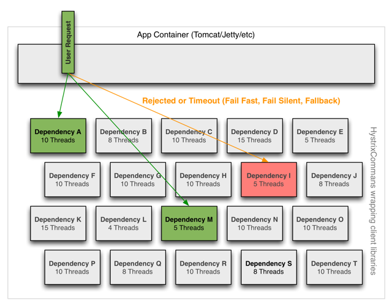
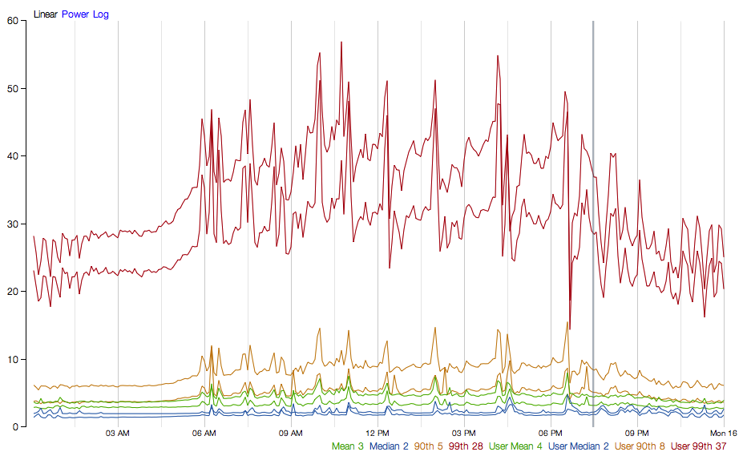
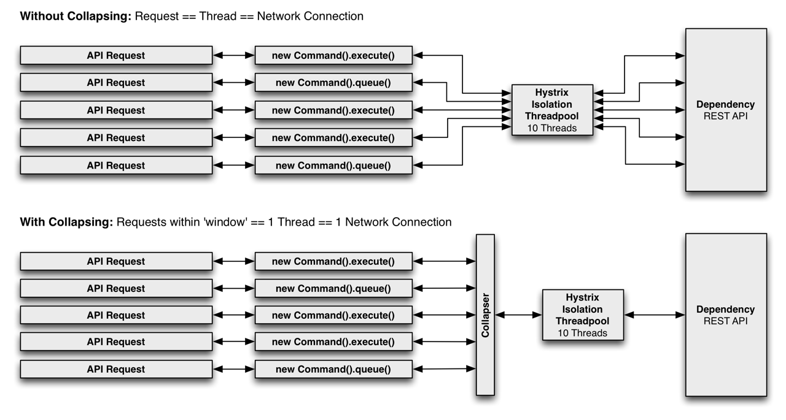
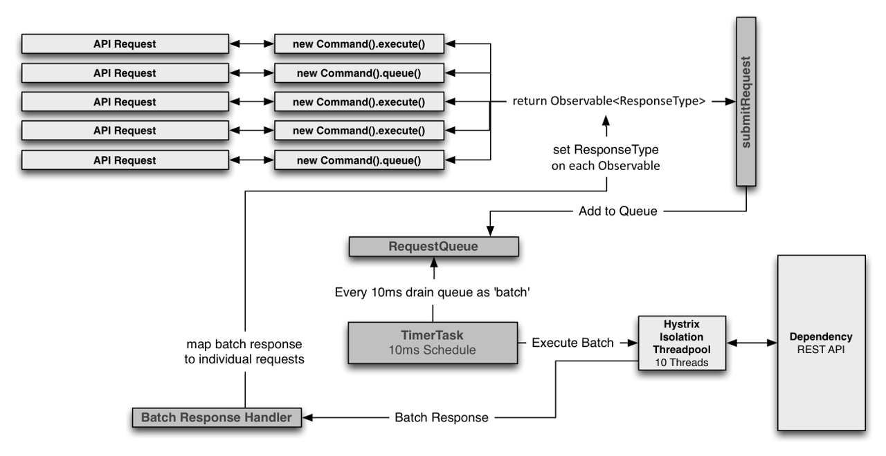

# Netfilx Hystrix How it Works

<!--https://github.com/Netflix/Hystrix/wiki/How-it-Works-->

##  Contents
* 1 [Flow Chart](#FlowChart)<!-- @IGNORE PREVIOUS: anchor -->
* 2 [Sequence Diagram](#SequenceDiagram)<!-- @IGNORE PREVIOUS: anchor -->
* 3 [Circuit Breaker](#CircuitBreaker)<!-- @IGNORE PREVIOUS: anchor -->
* 4 [Isolation](#Isolation)<!-- @IGNORE PREVIOUS: anchor -->
* 5 [Threads & Thread Pools](#Threads_Thread_Pools)<!-- @IGNORE PREVIOUS: anchor -->
* 6 [Request Collapsing](#Request_Collapsing)<!-- @IGNORE PREVIOUS: anchor -->
* 7 [Request Caching](#Request_Caching)<!-- @IGNORE PREVIOUS: anchor -->


## 1 Flow Chart <a name="FlowChart"><a>
The following diagram shows what happens when you make a request to a service dependency by means of Hystrix:


The following sections will explain this flow in greater detail:

* [Construct a HystrixCommand or HystrixObservableCommand Object](#anchor_1_1)<!-- @IGNORE PREVIOUS: anchor -->
* [Execute the Command](#anchor_1_2)<!-- @IGNORE PREVIOUS: anchor -->
* [Is the Response Cached?](#anchor_1_3)<!-- @IGNORE PREVIOUS: anchor -->
* [Is the Circuit Open?](#anchor_1_4)<!-- @IGNORE PREVIOUS: anchor -->
* [Is the Thread Pool/Queue/Semaphore Full?](#anchor_1_5)<!-- @IGNORE PREVIOUS: anchor -->
* [HystrixObservableCommand.construct() or HystrixCommand.run()](#anchor_1_6)<!-- @IGNORE PREVIOUS: anchor -->
* [Calculate Circuit Health](#anchor_1_7)<!-- @IGNORE PREVIOUS: anchor -->
* [Get the Fallback](#anchor_1_8)<!-- @IGNORE PREVIOUS: anchor -->
* [Return the Successful Response](#anchor_1_9)<!-- @IGNORE PREVIOUS: anchor -->


### 1.1 Construct a HystrixCommand or HystrixObservableCommand Object <a name="anchor_1_1"><a>

The first step is to construct a HystrixCommand or HystrixObservableCommand object to represent the request you are making to the dependency. Pass the constructor any arguments that will be needed when the request is made.

Construct a HystrixCommand object if the dependency is expected to return a single response. For example:

> HystrixCommand command = new HystrixCommand(arg1, arg2);

Construct a HystrixObservableCommand object if the dependency is expected to return an Observable that emits responses. For example:

> HystrixObservableCommand command = new HystrixObservableCommand(arg1, arg2);

### 1.2 Execute the Command <a name="anchor_1_2"><a>
There are four ways you can execute the command, by using one of the following four methods of your Hystrix command object (the first two are only applicable to simple HystrixCommand objects and are not available for the HystrixObservableCommand):

* execute() — blocks, then returns the single response received from the dependency (or throws an exception in case of an error)
* queue() — returns a Future with which you can obtain the single response from the dependency
* observe() — subscribes to the Observable that represents the response(s) from the dependency and returns an Observable that replicates that source Observable
* toObservable() — returns an Observable that, when you subscribe to it, will execute the Hystrix command and emit its responses

```java
K             value   = command.execute();  
Future<K>     fValue  = command.queue();  
Observable<K> ohValue = command.observe();         //hot observable  
Observable<K> ocValue = command.toObservable();    //cold observable
```

The synchronous call execute() invokes queue().get(). queue() in turn invokes toObservable().toBlocking().toFuture(). Which is to say that ultimately every HystrixCommand is backed by an Observable implementation, even those commands that are intended to return single, simple values.


### 1.3 Is the Response Cached? <a name="anchor_1_3"><a>

If request caching is enabled for this command, and if the response to the request is available in the cache, this cached response will be immediately returned in the form of an Observable. (See “Request Caching” below.)


### 1.4 Is the Circuit Open? <a name="anchor_1_4"><a>

When you execute the command, Hystrix checks with the circuit-breaker to see if the circuit is open.

If the circuit is open (or “tripped”) then Hystrix will not execute the command but will route the flow to (8) Get the Fallback.

If the circuit is closed then the flow proceeds to (5) to check if there is capacity available to run the command.


### 1.5 Is the Thread Pool/Queue/Semaphore Full? <a name="anchor_1_5"><a>

If the thread-pool and queue (or semaphore, if not running in a thread) that are associated with the command are full then Hystrix will not execute the command but will immediately route the flow to (8) Get the Fallback.


### 1.6 HystrixObservableCommand.construct() or HystrixCommand.run() <a name="anchor_1_6"><a>

Here, Hystrix invokes the request to the dependency by means of the method you have written for this purpose, one of the following:

* HystrixCommand.run() — returns a single response or throws an exception
* HystrixObservableCommand.construct() — returns an Observable that emits the response(s) or sends an onError notification

If the run() or construct() method exceeds the command’s timeout value, the thread will throw a TimeoutException (or a separate timer thread will, if the command itself is not running in its own thread). In that case Hystrix routes the response through 8. Get the Fallback, and it discards the eventual return value run() or construct() method if that method does not cancel/interrupt.

Please note that there's no way to force the latent thread to stop work - the best Hystrix can do on the JVM is to throw it an InterruptedException. If the work wrapped by Hystrix does not respect InterruptedExceptions, the thread in the Hystrix thread pool will continue its work, though the client already received a TimeoutException. This behavior can saturate the Hystrix thread pool, though the load is 'correctly shed'. Most Java HTTP client libraries do not interpret InterruptedExceptions. So make sure to correctly configure connection and read/write timeouts on the HTTP clients.

If the command did not throw any exceptions and it returned a response, Hystrix returns this response after it performs some some logging and metrics reporting. In the case of run(), Hystrix returns an Observable that emits the single response and then makes an onCompleted notification; in the case of construct() Hystrix returns the same Observable returned by construct().


### 1.7 Calculate Circuit Health <a name="anchor_1_7"><a>

Hystrix reports successes, failures, rejections, and timeouts to the circuit breaker, which maintains a rolling set of counters that calculate statistics.

It uses these stats to determine when the circuit should “trip,” at which point it short-circuits any subsequent requests until a recovery period elapses, upon which it closes the circuit again after first checking certain health checks.


### 1.8 Get the Fallback <a name="anchor_1_8"><a>

Hystrix tried to revert to your fallback whenever a command execution fails: when an exception is thrown by construct() or run() (6.), when the command is short-circuited because the circuit is open (4.), when the command’s thread pool and queue or semaphore are at capacity (5.), or when the command has exceeded its timeout length.

Write your fallback to provide a generic response, without any network dependency, from an in-memory cache or by means of other static logic. If you must use a network call in the fallback, you should do so by means of another HystrixCommand or HystrixObservableCommand.

In the case of a HystrixCommand, to provide fallback logic you implement HystrixCommand.getFallback() which returns a single fallback value.

In the case of a HystrixObservableCommand, to provide fallback logic you implement HystrixObservableCommand.resumeWithFallback() which returns an Observable that may emit a fallback value or values.

If the fallback method returns a response then Hystrix will return this response to the caller. In the case of a HystrixCommand.getFallback(), it will return an Observable that emits the value returned from the method. In the case of HystrixObservableCommand.resumeWithFallback() it will return the same Observable returned from the method.

If you have not implemented a fallback method for your Hystrix command, or if the fallback itself throws an exception, Hystrix still returns an Observable, but one that emits nothing and immediately terminates with an onError notification. It is through this onError notification that the exception that caused the command to fail is transmitted back to the caller. (It is a poor practice to implement a fallback implementation that can fail. You should implement your fallback such that it is not performing any logic that could fail.)

The result of a failed or nonexistent fallback will differ depending on how you invoked the Hystrix command:

* execute() — throws an exception
* queue() — successfully returns a Future, but this Future will throw an exception if its get() method is called
* observe() — returns an Observable that, when you subscribe to it, will immediately terminate by calling the subscriber’s onError method
* toObservable() — returns an Observable that, when you subscribe to it, will terminate by calling the subscriber’s onError method

### 1.9 Return the Successful Response <a name="anchor_1_9"><a>

If the Hystrix command succeeds, it will return the response or responses to the caller in the form of an Observable. Depending on how you have invoked the command in step 2, above, this Observable may be transformed before it is returned to you:


* execute() — obtains a Future in the same manner as does .queue() and then calls get() on this Future to obtain the single value emitted by the Observable
* queue() — converts the Observable into a BlockingObservable so that it can be converted into a Future, then returns this Future
* observe() — subscribes to the Observable immediately and begins the flow that executes the command; returns an Observable that, when you subscribe to it, replays the emissions and notifications
* toObservable() — returns the Observable unchanged; you must subscribe to it in order to actually begin the flow that leads to the execution of the command

## 2 Sequence Diagram <a name="SequenceDiagram"><a>
@adrianb11 has kindly provided a [sequence diagram](https://design.codelytics.io/hystrix/how-it-works) demonstrating the above flows


## 3 Circuit Breaker <a name="CircuitBreaker"><a>

The following diagram shows how a HystrixCommand or HystrixObservableCommand interacts with a HystrixCircuitBreaker and its flow of logic and decision-making, including how the counters behave in the circuit breaker.


The precise way that the circuit opening and closing occurs is as follows:

* 1 Assuming the volume across a circuit meets a certain threshold (HystrixCommandProperties.circuitBreakerRequestVolumeThreshold())...
* 2 And assuming that the error percentage exceeds the threshold error percentage (HystrixCommandProperties.circuitBreakerErrorThresholdPercentage())...
* 3 Then the circuit-breaker transitions from CLOSED to OPEN.
* 4 While it is open, it short-circuits all requests made against that circuit-breaker.
* 5 After some amount of time (HystrixCommandProperties.circuitBreakerSleepWindowInMilliseconds()), the next single request is let through (this is the HALF-OPEN state). If the request fails, the circuit-breaker returns to the OPEN state for the duration of the sleep window. If the request succeeds, the circuit-breaker transitions to CLOSED and the logic in 1. takes over again.

## 4 Isolation <a name="Isolation"><a>

Hystrix employs the bulkhead pattern to isolate dependencies from each other and to limit concurrent access to any one of them.



## 5 Threads & Thread Pools <a name="Threads_Thread_Pools"><a>
Clients (libraries, network calls, etc) execute on separate threads. This isolates them from the calling thread (Tomcat thread pool) so that the caller may “walk away” from a dependency call that is taking too long.

Hystrix uses separate, per-dependency thread pools as a way of constraining any given dependency so latency on the underlying executions will saturate the available threads only in that pool.


It is possible for you to protect against failure without the use of thread pools, but this requires the client being trusted to fail very quickly (network connect/read timeouts and retry configuration) and to always behave well.

Netflix, in its design of Hystrix, chose the use of threads and thread-pools to achieve isolation for many reasons including:

* Many applications execute dozens (and sometimes well over 100) different back-end service calls against dozens of different services developed by as many different teams.
* Each service provides its own client library.
* Client libraries are changing all the time.
* Client library logic can change to add new network calls.
* Client libraries can contain logic such as retries, data parsing, caching (in-memory or across network), and other such behavior.
* Client libraries tend to be “black boxes” — opaque to their users about implementation details, network access patterns, configuration defaults, etc.
* In several real-world production outages the determination was “oh, something changed and properties should be adjusted” or “the client library changed its behavior.”
* Even if a client itself doesn’t change, the service itself can change, which can then impact performance characteristics which can then cause the client configuration to be invalid.
* Transitive dependencies can pull in other client libraries that are not expected and perhaps not correctly configured.
* Most network access is performed synchronously.
* Failure and latency can occur in the client-side code as well, not just in the network call.


###  Benefits of Thread Pools

The benefits of isolation via threads in their own thread pools are:

* The application is fully protected from runaway client libraries. The pool for a given dependency library can fill up without impacting the rest of the application.
* The application can accept new client libraries with far lower risk. If an issue occurs, it is isolated to the library and doesn’t affect everything else.
* When a failed client becomes healthy again, the thread pool will clear up and the application immediately resumes healthy performance, as opposed to a long recovery when the entire Tomcat container is overwhelmed.
* If a client library is misconfigured, the health of a thread pool will quickly demonstrate this (via increased errors, latency, timeouts, rejections, etc.) and you can handle it (typically in real-time via dynamic properties) without affecting application functionality.
* If a client service changes performance characteristics (which happens often enough to be an issue) which in turn cause a need to tune properties (increasing/decreasing timeouts, changing retries, etc.) this again becomes visible through thread pool metrics (errors, latency, timeouts, rejections) and can be handled without impacting other clients, requests, or users.
* Beyond the isolation benefits, having dedicated thread pools provides built-in concurrency which can be leveraged to build asynchronous facades on top of synchronous client libraries (similar to how the Netflix API built a reactive, fully-asynchronous Java API on top of Hystrix commands).

In short, the isolation provided by thread pools allows for the always-changing and dynamic combination of client libraries and subsystem performance characteristics to be handled gracefully without causing outages.

Note: Despite the isolation a separate thread provides, your underlying client code should also have timeouts and/or respond to Thread interrupts so it can not block indefinitely and saturate the Hystrix thread pool.

###  Drawbacks of Thread Pools

The primary drawback of thread pools is that they add computational overhead. Each command execution involves the queueing, scheduling, and context switching involved in running a command on a separate thread.

Netflix, in designing this system, decided to accept the cost of this overhead in exchange for the benefits it provides and deemed it minor enough to not have major cost or performance impact.

###  Cost of Threads

Hystrix measures the latency when it executes the construct() or run() method on the child thread as well as the total end-to-end time on the parent thread. This way you can see the cost of Hystrix overhead (threading, metrics, logging, circuit breaker, etc.).

The Netflix API processes 10+ billion Hystrix Command executions per day using thread isolation. Each API instance has 40+ thread-pools with 5–20 threads in each (most are set to 10).

The following diagram represents one HystrixCommand being executed at 60 requests-per-second on a single API instance (of about 350 total threaded executions per second per server):




At the median (and lower) there is no cost to having a separate thread.

At the 90th percentile there is a cost of 3ms for having a separate thread.

At the 99th percentile there is a cost of 9ms for having a separate thread. Note however that the increase in cost is far smaller than the increase in execution time of the separate thread (network request) which jumped from 2 to 28 whereas the cost jumped from 0 to 9.

This overhead at the 90th percentile and higher for circuits such as these has been deemed acceptable for most Netflix use cases for the benefits of resilience achieved.

For circuits that wrap very low-latency requests (such as those that primarily hit in-memory caches) the overhead can be too high and in those cases you can use another method such as tryable semaphores which, while they do not allow for timeouts, provide most of the resilience benefits without the overhead. The overhead in general, however, is small enough that Netflix in practice usually prefers the isolation benefits of a separate thread over such techniques.

### Semaphores

You can use semaphores (or counters) to limit the number of concurrent calls to any given dependency, instead of using thread pool/queue sizes. This allows Hystrix to shed load without using thread pools but it does not allow for timing out and walking away. If you trust the client and you only want load shedding, you could use this approach.

HystrixCommand and HystrixObservableCommand support semaphores in 2 places:

* Fallback: When Hystrix retrieves fallbacks it always does so on the calling Tomcat thread.
* Execution: If you set the property execution.isolation.strategy to SEMAPHORE then Hystrix will use semaphores instead of threads to limit the number of concurrent parent threads that invoke the command.

You can configure both of these uses of semaphores by means of dynamic properties that define how many concurrent threads can execute. You should size them by using similar calculations as you use when sizing a threadpool (an in-memory call that returns in sub-millisecond times can perform well over 5000rps with a semaphore of only 1 or 2 … but the default is 10).

Note: if a dependency is isolated with a semaphore and then becomes latent, the parent threads will remain blocked until the underlying network calls timeout.

Semaphore rejection will start once the limit is hit but the threads filling the semaphore can not walk away.


## 6 Request Collapsing <a name="Request_Collapsing"><a>

You can front a HystrixCommand with a request collapser (HystrixCollapser is the abstract parent) with which you can collapse multiple requests into a single back-end dependency call.

The following diagram shows the number of threads and network connections in two scenarios: first without and then with request collapsing (assuming all connections are “concurrent” within a short time window, in this case 10ms).



###  Sequence Diagram
@adrianb11 has kindly provided a [sequence diagram](https://design.codelytics.io/hystrix/request-collapsing) of request-collapsing.

###  Why Use Request Collapsing?
Use request collapsing to reduce the number of threads and network connections needed to perform concurrent HystrixCommand executions. Request collapsing does this in an automated manner that does not force all developers of a codebase to coordinate the manual batching of requests.

####  Global Context (Across All Tomcat Threads)

The ideal type of collapsing is done at the global application level, so that requests from any user on any Tomcat thread can be collapsed together.

For example, if you configure a HystrixCommand to support batching for any user on requests to a dependency that retrieves movie ratings, then when any user thread in the same JVM makes such a request, Hystrix will add its request along with any others into the same collapsed network call.

Note that the collapser will pass a single HystrixRequestContext object to the collapsed network call, so downstream systems must need to handle this case for this to be an effective option.

#### User Request Context (Single Tomcat Thread)
If you configure a HystrixCommand to only handle batch requests for a single user, then Hystrix can collapse requests from within a single Tomcat thread (request).

For example, if a user wants to load bookmarks for 300 video objects, instead of executing 300 network calls, Hystrix can combine them all into one.

#### Object Modeling and Code Complexity

Sometimes when you create an object model that makes logical sense to the consumers of the object, this does not match up well with efficient resource utilization for the producers of the object.

For example, given a list of 300 video objects, iterating over them and calling getSomeAttribute() on each is an obvious object model, but if implemented naively can result in 300 network calls all being made within milliseconds of each other (and very likely saturating resources).

There are manual ways with which you can handle this, such as before allowing the user to call getSomeAttribute(), require them to declare what video objects they want to get attributes for so that they can all be pre-fetched.

Or, you could divide the object model so a user has to get a list of videos from one place, then ask for the attributes for that list of videos from somewhere else.

These approaches can lead to awkward APIs and object models that don’t match mental models and usage patterns. They can also lead to simple mistakes and inefficiencies as multiple developers work on a codebase, since an optimization done for one use case can be broken by the implementation of another use case and a new path through the code.

By pushing the collapsing logic down to the Hystrix layer, it doesn’t matter how you create the object model, in what order the calls are made, or whether different developers know about optimizations being done or even needing to be done.

The getSomeAttribute() method can be put wherever it fits best and be called in whatever manner suits the usage pattern and the collapser will automatically batch calls into time windows.

####  What Is the Cost of Request Collapsing?

The cost of enabling request collapsing is an increased latency before the actual command is executed. The maximum cost is the size of the batch window.

If you have a command that takes 5ms on median to execute, and a 10ms batch window, the execution time could become 15ms in a worst case. Typically a request will not happen to be submitted to the window just as it opens, and so the median penalty is half the window time, in this case 5ms.

The determination of whether this cost is worth it depends on the command being executed. A high-latency command won’t suffer as much from a small amount of additional average latency. Also, the amount of concurrency on a given command is key: There is no point in paying the penalty if there are rarely more than 1 or 2 requests to be batched together. In fact, in a single-threaded sequential iteration collapsing would be a major performance bottleneck as each iteration will wait the 10ms batch window time.

If, however, a particular command is heavily utilized concurrently and can batch dozens or even hundreds of calls together, then the cost is typically far outweighed by the increased throughput achieved as Hystrix reduces the number of threads it requires and the number of network connections to dependencies.


#### Collapser Flow




## 7 Request Caching <a name="Request_Caching"><a>

HystrixCommand and HystrixObservableCommand implementations can define a cache key which is then used to de-dupe calls within a request context in a concurrent-aware manner.

Here is an example flow involving an HTTP request lifecycle and two threads doing work within that request:


The benefits of request caching are:
* Different code paths can execute Hystrix Commands without concern of duplicate work.

This is particularly beneficial in large codebases where many developers are implementing different pieces of functionality.

For example, multiple paths through code that all need to get a user’s Account object can each request it like this:

```java
Account account = new UserGetAccount(accountId).execute();

//or

Observable<Account> accountObservable = new UserGetAccount(accountId).observe();
```

The Hystrix RequestCache will execute the underlying run() method once and only once, and both threads executing the HystrixCommand will receive the same data despite having instantiated different instances.

* Data retrieval is consistent throughout a request.

Instead of potentially returning a different value (or fallback) each time the command is executed, the first response is cached and returned for all subsequent calls within the same request.

* Eliminates duplicate thread executions.

Since the request cache sits in front of the construct() or run() method invocation, Hystrix can de-dupe calls before they result in thread execution.

If Hystrix didn’t implement the request cache functionality then each command would need to implement it themselves inside the construct or run method, which would put it after a thread is queued and executed.


## Related Content
* [Part1 overview](README.md)
* [Part2 Spring Cloud Config and Vault](README02_Config_Vault.md)
* [Part3 Service Registry and Discovery](README03_Registry_Discovery.md)
* [Part4 Circuit Breaker using Netflix Hystrix](README04_Circuit_Breaker.md)
* [Part5 Zuul Proxy as API Gateway](README05_API_Gateway.md)
* [Part6 Distributed Tracing with Sleuth and Zipkin](README06_Distributed_Tracing.md)

* [Spring cloud config server](README11_Spring_Cloud_Config_Server.md)
* [Spring cloud config client](README11_Spring_Cloud_Config_Client.md)
* [Spring cloud bus](README12_Spring_Cloud_Bus.md)
* [Spring Microservices Docker Example](https://github.com/thefirstwind/spring-microservices-docker-example/blob/master/README.md)
* [Spring Cloud Eureka and Feign](README13_Spring_Cloud_Eureka.md)
* [Netflix Hystrix How It Works](README14_Netflix_Hystrix_How_it_works.md)
* [Netflix Hystrix How to Use](README15_Netflix_Hystrix_How_To_Use.md)
