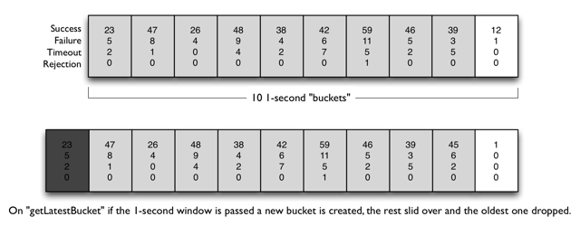

# Configuration

<!--https://github.com/Netflix/Hystrix/wiki/Configuration-->

##  Contents
* 1 [Introduction](#anchor100)<!-- @IGNORE PREVIOUS: anchor -->
* 2 [Command Properties](#anchor200)<!-- @IGNORE PREVIOUS: anchor -->
  * 2.1 [Execution](#anchor210)<!-- @IGNORE PREVIOUS: anchor -->
    * 2.1.1 [execution.isolation.strategy](#anchor211)<!-- @IGNORE PREVIOUS: anchor -->
    * 2.1.2 [execution.isolation.thread.timeoutInMilliseconds](#anchor212)<!-- @IGNORE PREVIOUS: anchor -->
    * 2.1.3 [execution.timeout.enabled](#anchor213)<!-- @IGNORE PREVIOUS: anchor -->
    * 2.1.4 [execution.isolation.thread.interruptOnTimeout](#anchor214)<!-- @IGNORE PREVIOUS: anchor -->
    * 2.1.5 [execution.isolation.thread.interruptOnCancel](#anchor215)<!-- @IGNORE PREVIOUS: anchor -->
    * 2.1.6 [execution.isolation.semaphore.maxConcurrentRequests](#anchor216)<!-- @IGNORE PREVIOUS: anchor -->
  * 2.2 [Fallback](#anchor220)<!-- @IGNORE PREVIOUS: anchor -->
    * 2.2.1 [fallback.isolation.semaphore.maxConcurrentRequests](#anchor221)<!-- @IGNORE PREVIOUS: anchor -->
    * 2.2.2 [fallback.enabled](#anchor222)<!-- @IGNORE PREVIOUS: anchor -->
  * 2.3 [Circuit Breaker](#anchor230)<!-- @IGNORE PREVIOUS: anchor -->
    * 2.3.1 [circuitBreaker.enabled](#anchor231)<!-- @IGNORE PREVIOUS: anchor -->
    * 2.3.2 [circuitBreaker.requestVolumeThreshold](#anchor232)<!-- @IGNORE PREVIOUS: anchor -->
    * 2.3.3 [circuitBreaker.sleepWindowInMilliseconds](#anchor233)<!-- @IGNORE PREVIOUS: anchor -->
    * 2.3.4 [circuitBreaker.errorThresholdPercentage](#anchor234)<!-- @IGNORE PREVIOUS: anchor -->
    * 2.3.5 [circuitBreaker.forceOpen](#anchor235)<!-- @IGNORE PREVIOUS: anchor -->
    * 2.3.6 [circuitBreaker.forceClosed](#anchor236)<!-- @IGNORE PREVIOUS: anchor -->
  * 2.4 [Metrics](#anchor240)<!-- @IGNORE PREVIOUS: anchor -->
    * 2.4.1 [metrics.rollingStats.timeInMilliseconds](#anchor241)<!-- @IGNORE PREVIOUS: anchor -->
    * 2.4.2 [metrics.rollingStats.numBuckets](#anchor242)<!-- @IGNORE PREVIOUS: anchor -->
    * 2.4.3 [metrics.rollingPercentile.enabled](#anchor243)<!-- @IGNORE PREVIOUS: anchor -->
    * 2.4.4 [metrics.rollingPercentile.timeInMilliseconds](#anchor244)<!-- @IGNORE PREVIOUS: anchor -->
    * 2.4.5 [metrics.rollingPercentile.numBuckets](#anchor245)<!-- @IGNORE PREVIOUS: anchor -->
    * 2.4.6 [metrics.rollingPercentile.bucketSize](#anchor246)<!-- @IGNORE PREVIOUS: anchor -->
    * 2.4.7 [metrics.healthSnapshot.intervalInMilliseconds](#anchor247)<!-- @IGNORE PREVIOUS: anchor -->
  * 2.5 [Request Context](#anchor250)<!-- @IGNORE PREVIOUS: anchor -->
    * 2.5.1 [requestCache.enabled](#anchor251)<!-- @IGNORE PREVIOUS: anchor -->
    * 2.5.2 [requestLog.enabled](#anchor252)<!-- @IGNORE PREVIOUS: anchor -->
* 3 [Collapser Properties](#anchor300)<!-- @IGNORE PREVIOUS: anchor -->
  * 3.1 [maxRequestsInBatch](#anchor310)<!-- @IGNORE PREVIOUS: anchor -->
  * 3.2 [timerDelayInMilliseconds](#anchor320)<!-- @IGNORE PREVIOUS: anchor -->
  * 3.3 [requestCache.enabled](#anchor330)<!-- @IGNORE PREVIOUS: anchor -->
* 4 [Thread Pool Properties](#anchor400)<!-- @IGNORE PREVIOUS: anchor -->
  * 4.1 [coreSize](#anchor410)<!-- @IGNORE PREVIOUS: anchor -->
  * 4.2 [maximumSize](#anchor420)<!-- @IGNORE PREVIOUS: anchor -->
  * 4.3 [maxQueueSize](#anchor430)<!-- @IGNORE PREVIOUS: anchor -->
  * 4.4 [queueSizeRejectionThreshold](#anchor440)<!-- @IGNORE PREVIOUS: anchor -->
  * 4.5 [keepAliveTimeMinutes](#anchor450)<!-- @IGNORE PREVIOUS: anchor -->
  * 4.6 [allowMaximumSizeToDivergeFromCoreSize](#anchor460)<!-- @IGNORE PREVIOUS: anchor -->
  * 4.7 [metrics.rollingStats.timeInMilliseconds](#anchor470)<!-- @IGNORE PREVIOUS: anchor -->
  * 4.8 [metrics.rollingStats.numBuckets](#anchor480)<!-- @IGNORE PREVIOUS: anchor -->


<a name="anchor100"><a>
## 1 Introduction

Hystrix uses Archaius for the default implementation of properties for configuration.

The documentation below describes the default HystrixPropertiesStrategy implementation that is used unless you override it by using a plugin.

Each property has four levels of precedence:

### 1.1 Global default from code
This is the default if none of the following 3 are set.

The global default is shown as “Default Value” in the tables below.

### 1.2 Dynamic global default property

You can change a global default value by using properties.

The global default property name is shown as “Default Property” in the tables below.

### 1.3 Instance default from code

You can define an instance-specific default. Example:

```java
HystrixCommandProperties.Setter()
   .withExecutionTimeoutInMilliseconds(int value)
```

You would insert a command of this sort into a HystrixCommand constructor in a manner similar to this:

```java
public HystrixCommandInstance(int id) {
    super(Setter.withGroupKey(HystrixCommandGroupKey.Factory.asKey("ExampleGroup"))
        .andCommandPropertiesDefaults(HystrixCommandProperties.Setter()
               .withExecutionTimeoutInMilliseconds(500)));
    this.id = id;
}
```

There are convenience constructors for commonly-set initial values. Here's an example:

```java
public HystrixCommandInstance(int id) {
    super(HystrixCommandGroupKey.Factory.asKey("ExampleGroup"), 500);
    this.id = id;
}
```

### 1.4 Dynamic instance property

You can set instance-specific values dynamically which override the preceding three levels of defaults.

The dynamic instance property name is shown as “Instance Property” in the tables below.

Example:

```
Instance Property	hystrix.command.HystrixCommandKey.execution.isolation.thread.timeoutInMilliseconds
```
Replace the HystrixCommandKey portion of the property with the HystrixCommandKey.name() value of whichever HystrixCommand you are targeting.

For example, if the key was named “SubscriberGetAccount” then the property name would be:

```
hystrix.command.SubscriberGetAccount.execution.isolation.thread.timeoutInMilliseconds
```

<a name="anchor200"><a>
## 2 Command Properties

The following Properties control HystrixCommand behavior:

<a name="anchor210"><a>
### 2.1 Execution

The following Properties control how HystrixCommand.run() executes.

<a name="anchor211"><a>
#### 2.1.1 execution.isolation.strategy

This property indicates which isolation strategy HystrixCommand.run() executes with, one of the following two choices:

* THREAD — it executes on a separate thread and concurrent requests are limited by the number of threads in the thread-pool
* SEMAPHORE — it executes on the calling thread and concurrent requests are limited by the semaphore count

##### Thread or Semaphore

The default, and the recommended setting, is to run HystrixCommands using thread isolation (THREAD) and HystrixObservableCommands using semaphore isolation (SEMAPHORE).

Commands executed in threads have an extra layer of protection against latencies beyond what network timeouts can offer.

Generally the only time you should use semaphore isolation for HystrixCommands is when the call is so high volume (hundreds per second, per instance) that the overhead of separate threads is too high; this typically only applies to non-network calls.

> Netflix API has 100+ commands running in 40+ thread pools and only a handful of those  
> commands are not running in a  thread - those that fetch metadata from an in-memory cache or  
> that are façades to thread-isolated commands (see “[Primary + Secondary with Fallback pattern](https://github.com/thefirstwind/springcloud-series/blob/master/README15_Netflix_Hystrix_How_To_Use.md#anchor14)”  
> for more information on this).


See [how isolation works](https://github.com/thefirstwind/springcloud-series/blob/master/README14_Netflix_Hystrix_How_it_works.md#Isolation) for more information about this decision.

|||
|------|------|
|Default Value	| THREAD (see ExecutionIsolationStrategy.THREAD)|
|Possible Values	|THREAD, SEMAPHORE|
|Default Property	|hystrix.command.default.execution.isolation.strategy|
|Instance Property	|hystrix.command.HystrixCommandKey.execution.isolation.strategy|
|How to Set Instance Default|// to use thread isolation<br/>HystrixCommandProperties.Setter()<br/>   .withExecutionIsolationStrategy(ExecutionIsolationStrategy.THREAD)<br/>// to use semaphore isolation<br/>HystrixCommandProperties.Setter()<br/>   .withExecutionIsolationStrategy(ExecutionIsolationStrategy.SEMAPHORE)<br/>|


<a name="anchor212"><a>
#### 2.1.2 execution.isolation.thread.timeoutInMilliseconds

This property sets the time in milliseconds after which the caller will observe a timeout and walk away from the command execution. Hystrix marks the HystrixCommand as a TIMEOUT, and performs fallback logic. Note that there is configuration for turning off timeouts per-command, if that is desired (see command.timeout.enabled).

Note: Timeouts will fire on HystrixCommand.queue(), even if the caller never calls get() on the resulting Future. Before Hystrix 1.4.0, only calls to get() triggered the timeout mechanism to take effect in such a case.

|||
|--------------|----------------|
|Default Value	|1000|
|Default Property	|hystrix.command.default.execution.isolation.thread.timeoutInMilliseconds|
|Instance Property	|hystrix.command.HystrixCommandKey.execution.isolation.thread.timeoutInMilliseconds|
|How to Set Instance Default|HystrixCommandProperties.Setter()<br/>.withExecutionTimeoutInMilliseconds(int value)|


<a name="anchor213"><a>
#### 2.1.3 execution.timeout.enabled

This property indicates whether the HystrixCommand.run() execution should have a timeout.


|||
|--------------|----------------|
|Default Value	|true|
|Default Property	|hystrix.command.default.execution.timeout.enabled|
|Instance Property	|hystrix.command.HystrixCommandKey.execution.timeout.enabled|
|How to Set Instance Default	|HystrixCommandProperties.Setter()<br/>.withExecutionTimeoutEnabled(boolean value)|

<a name="anchor214"><a>
#### 2.1.4 execution.isolation.thread.interruptOnTimeout

This property indicates whether the HystrixCommand.run() execution should be interrupted when a timeout occurs.


|||
|--------------|----------------|
|Default Value	|true|
|Default Property	|hystrix.command.default.execution.isolation.thread.interruptOnTimeout|
|Instance Property	|hystrix.command.HystrixCommandKey.execution.isolation.thread.interruptOnTimeout|
|How to Set Instance Default	|HystrixCommandProperties.Setter()<br/>.withExecutionIsolationThreadInterruptOnTimeout(boolean value)|


<a name="anchor215"><a>
#### 2.1.5 execution.isolation.thread.interruptOnCancel

This property indicates whether the HystrixCommand.run() execution should be interrupted when a cancellation occurs.

|||
|--------------|----------------|
|Default Value	|false|
|Default Property	|hystrix.command.default.execution.isolation.thread.interruptOnCancel|
|Instance Property	|hystrix.command.HystrixCommandKey.execution.isolation.thread.interruptOnCancel|
|How to Set Instance Default	|HystrixCommandProperties.Setter()<br/>   .withExecutionIsolationThreadInterruptOnCancel(boolean value)|


<a name="anchor216"><a>
#### 2.1.6 execution.isolation.semaphore.maxConcurrentRequests

This property sets the maximum number of requests allowed to a HystrixCommand.run() method when you are using ExecutionIsolationStrategy.SEMAPHORE.

If this maximum concurrent limit is hit then subsequent requests will be rejected.

The logic that you use when you size a semaphore is basically the same as when you choose how many threads to add to a thread-pool, but the overhead for a semaphore is far smaller and typically the executions are far faster (sub-millisecond), otherwise you would be using threads.

> For example, 5000rps on a single instance for in-memory lookups with metrics being gathered has been seen to work with a semaphore of only 2.

The isolation principle is still the same so the semaphore should still be a small percentage of the overall container (i.e. Tomcat) thread pool, not all of or most of it, otherwise it provides no protection.


|||
|--------------|----------------|
|Default Value	|10|
|Default Property	|hystrix.command.default.execution.isolation.semaphore.maxConcurrentRequests|
|Instance Property	|hystrix.command.HystrixCommandKey.execution.isolation.semaphore.maxConcurrentRequests|
|How to Set Instance Default	|HystrixCommandProperties.Setter()<br/>.withExecutionIsolationSemaphoreMaxConcurrentRequests(int value)|


<a name="anchor220"><a>
### 2.2 Fallback

The following properties control how HystrixCommand.getFallback() executes. These properties apply to both ExecutionIsolationStrategy.THREAD and ExecutionIsolationStrategy.SEMAPHORE.


<a name="anchor221"><a>
#### 2.2.1 fallback.isolation.semaphore.maxConcurrentRequests

This property sets the maximum number of requests a HystrixCommand.getFallback() method is allowed to make from the calling thread.

If the maximum concurrent limit is hit then subsequent requests will be rejected and an exception thrown since no fallback could be retrieved.


|||
|--------------|----------------|
|Default Value	|10|
|Default Property	|hystrix.command.default.fallback.isolation.semaphore.maxConcurrentRequests|
|Instance Property	|hystrix.command.HystrixCommandKey.fallback.isolation.semaphore.maxConcurrentRequests|
|How to Set Instance Default	|HystrixCommandProperties.Setter()<br/>   .withFallbackIsolationSemaphoreMaxConcurrentRequests(int value)|

<a name="anchor222"><a>
#### 2.2.2 fallback.enabled

This property determines whether a call to HystrixCommand.getFallback() will be attempted when failure or rejection occurs.

|||
|--------------|----------------|
|Default Value	|true|
|Default Property	|hystrix.command.default.fallback.enabled|
|Instance Property	|hystrix.command.HystrixCommandKey.fallback.enabled|
|How to Set Instance Default	|HystrixCommandProperties.Setter()<br/>   .withFallbackEnabled(boolean value)|


<a name="anchor230"><a>
### 2.3 Circuit Breaker

The circuit breaker properties control behavior of the HystrixCircuitBreaker.

<a name="anchor232"><a>
#### 2.3.1 circuitBreaker.enabled

This property determines whether a circuit breaker will be used to track health and to short-circuit requests if it trips.


|||
|--------------|----------------|
|Default Value	|true|
|Default Property	|hystrix.command.default.circuitBreaker.enabled|
|Instance Property	|hystrix.command.HystrixCommandKey.circuitBreaker.enabled|
|How to Set Instance Default	|HystrixCommandProperties.Setter()<br/>   .withCircuitBreakerEnabled(boolean value)|


<a name="anchor232"><a>
#### 2.3.2 circuitBreaker.requestVolumeThreshold

This property sets the minimum number of requests in a rolling window that will trip the circuit.

For example, if the value is 20, then if only 19 requests are received in the rolling window (say a window of 10 seconds) the circuit will not trip open even if all 19 failed.


|||
|--------------|----------------|
|Default Value	|20|
|Default Property	|hystrix.command.default.circuitBreaker.requestVolumeThreshold|
|Instance Property	|hystrix.command.HystrixCommandKey.circuitBreaker.requestVolumeThreshold|
|How to Set Instance Default	|HystrixCommandProperties.Setter()<br/>   .withCircuitBreakerRequestVolumeThreshold(int value)|


<a name="anchor233"><a>
#### 2.3.3 circuitBreaker.sleepWindowInMilliseconds

This property sets the amount of time, after tripping the circuit, to reject requests before allowing attempts again to determine if the circuit should again be closed.


|||
|--------------|----------------|
|Default Value	|5000|
|Default Property	|hystrix.command.default.circuitBreaker.sleepWindowInMilliseconds|
|Instance Property	|hystrix.command.HystrixCommandKey.circuitBreaker.sleepWindowInMilliseconds|
|How to Set Instance Default	|HystrixCommandProperties.Setter()<br/>   .withCircuitBreakerSleepWindowInMilliseconds(int value)|


<a name="anchor234"><a>
#### 2.3.4 circuitBreaker.errorThresholdPercentage

This property sets the error percentage at or above which the circuit should trip open and start short-circuiting requests to fallback logic.

|||
|--------------|----------------|
|Default Value	|50|
|Default Property	|hystrix.command.default.circuitBreaker.errorThresholdPercentage|
|Instance Property	|hystrix.command.HystrixCommandKey.circuitBreaker.errorThresholdPercentage|
|How to Set Instance Default	|HystrixCommandProperties.Setter()<br/>   .withCircuitBreakerErrorThresholdPercentage(int value)|


<a name="anchor235"><a>
#### 2.3.5 circuitBreaker.forceOpen

This property, if true, forces the circuit breaker into an open (tripped) state in which it will reject all requests.

This property takes precedence over circuitBreaker.forceClosed.


|||
|--------------|----------------|
|Default Value	|false|
|Default Property	|hystrix.command.default.circuitBreaker.forceOpen|
|Instance Property	|hystrix.command.HystrixCommandKey.circuitBreaker.forceOpen|
|How to Set Instance Default	|HystrixCommandProperties.Setter()<br/>   .withCircuitBreakerForceOpen(boolean value)|


<a name="anchor236"><a>
#### 2.3.6 circuitBreaker.forceClosed

This property, if true, forces the circuit breaker into a closed state in which it will allow requests regardless of the error percentage.

The circuitBreaker.forceOpen property takes precedence so if it is set to true this property does nothing.


|||
|--------------|----------------|
|Default Value	|false|
|Default Property	|hystrix.command.default.circuitBreaker.forceClosed|
|Instance Property	|hystrix.command.HystrixCommandKey.circuitBreaker.forceClosed|
|How to Set Instance Default	|HystrixCommandProperties.Setter()<br/>   .withCircuitBreakerForceClosed(boolean value)|


<a name="anchor240"><a>
### 2.4 Metrics

The following properties are related to capturing metrics from HystrixCommand and HystrixObservableCommand execution.


<a name="anchor241"><a>
#### 2.4.1 metrics.rollingStats.timeInMilliseconds

This property sets the duration of the statistical rolling window, in milliseconds. This is how long Hystrix keeps metrics for the circuit breaker to use and for publishing.

As of 1.4.12, this property affects the initial metrics creation only, and adjustments made to this property after startup will not take effect. This avoids metrics data loss, and allows optimizations to metrics gathering.

The window is divided into buckets and “rolls” by these increments.

For example, if this property is set to 10 seconds (10000) with ten 1-second buckets, the following diagram represents how it rolls new buckets on and old ones off:



|||
|--------------|----------------|
|Default Value	|10000|
|Default Property	|hystrix.command.default.metrics.rollingStats.timeInMilliseconds|
|Instance Property	|hystrix.command.HystrixCommandKey.metrics.rollingStats.timeInMilliseconds|
|How to Set Instance Default	|HystrixCommandProperties.Setter()<br/>   .withMetricsRollingStatisticalWindowInMilliseconds(int value)|


<a name="anchor242"><a>
#### 2.4.2 metrics.rollingStats.numBuckets

This property sets the number of buckets the rolling statistical window is divided into.

Note: The following must be true — “metrics.rollingStats.timeInMilliseconds % metrics.rollingStats.numBuckets == 0” — otherwise it will throw an exception.

In other words, 10000/10 is okay, so is 10000/20 but 10000/7 is not.

As of 1.4.12, this property affects the initial metrics creation only, and adjustments made to this property after startup will not take effect. This avoids metrics data loss, and allows optimizations to metrics gathering.


|||
|--------------|----------------|
|Default Value	|10|
|Possible Values|Any value that metrics.rollingStats.timeInMilliseconds can be evenly divided by. The result however should be buckets measuring hundreds or thousands of milliseconds. Performance at high volume has not been tested with buckets <100ms.|
|Default Property	|hystrix.command.default.metrics.rollingStats.numBuckets|
|Instance Property	|hystrix.command.HystrixCommandKey.metrics.rollingStats.numBuckets|
|How to Set Instance Default	|HystrixCommandProperties.Setter()<br/>   .withMetricsRollingStatisticalWindowBuckets(int value)|


<a name="anchor243"><a>
#### 2.4.3 metrics.rollingPercentile.enabled

This property indicates whether execution latencies should be tracked and calculated as percentiles. If they are disabled, all summary statistics (mean, percentiles) are returned as -1.


|||
|--------------|----------------|
|Default Value	|true|
|Default Property	|hystrix.command.default.metrics.rollingPercentile.enabled|
|Instance Property	|hystrix.command.HystrixCommandKey.metrics.rollingPercentile.enabled|
|How to Set Instance Default	|HystrixCommandProperties.Setter()<br/>   .withMetricsRollingPercentileEnabled(boolean value)|


<a name="anchor244"><a>
#### 2.4.4 metrics.rollingPercentile.timeInMilliseconds

This property sets the duration of the rolling window in which execution times are kept to allow for percentile calculations, in milliseconds.

The window is divided into buckets and “rolls” by those increments.

As of 1.4.12, this property affects the initial metrics creation only, and adjustments made to this property after startup will not take effect. This avoids metrics data loss, and allows optimizations to metrics gathering.

|||
|--------------|----------------|
|Default Value	|60000|
|Default Property	|hystrix.command.default.metrics.rollingPercentile.timeInMilliseconds|
|Instance Property	|hystrix.command.HystrixCommandKey.metrics.rollingPercentile.timeInMilliseconds|
|How to Set Instance Default	|HystrixCommandProperties.Setter()<br/>   .withMetricsRollingPercentileWindowInMilliseconds(int value)|


<a name="anchor245"><a>
#### 2.4.5 metrics.rollingPercentile.numBuckets
This property sets the number of buckets the rollingPercentile window will be divided into.

Note: The following must be true — “metrics.rollingPercentile.timeInMilliseconds % metrics.rollingPercentile.numBuckets == 0” — otherwise it will throw an exception.

In other words, 60000/6 is okay, so is 60000/60 but 10000/7 is not.

As of 1.4.12, this property affects the initial metrics creation only, and adjustments made to this property after startup will not take effect. This avoids metrics data loss, and allows optimizations to metrics gathering.


|||
|--------------|----------------|
|Default Value	|6|
|Possible Values|Any value that metrics.rollingPercentile.timeInMilliseconds can be evenly divided by. The result however should be buckets measuring thousands of milliseconds. Performance at high volume has not been tested with buckets <1000ms.|
|Default Property	|hystrix.command.default.metrics.rollingPercentile.numBuckets|
|Instance Property	|hystrix.command.HystrixCommandKey.metrics.rollingPercentile.numBuckets|
|How to Set Instance Default	|HystrixCommandProperties.Setter()<br/>   .withMetricsRollingPercentileWindowBuckets(int value)|


<a name="anchor246"><a>
#### 2.4.6 metrics.rollingPercentile.bucketSize
This property sets the maximum number of execution times that are kept per bucket. If more executions occur during the time they will wrap around and start over-writing at the beginning of the bucket.

For example, if bucket size is set to 100 and represents a bucket window of 10 seconds, but 500 executions occur during this time, only the last 100 executions will be kept in that 10 second bucket.

If you increase this size, this also increases the amount of memory needed to store values and increases the time needed for sorting the lists to do percentile calculations.

As of 1.4.12, this property affects the initial metrics creation only, and adjustments made to this property after startup will not take effect. This avoids metrics data loss, and allows optimizations to metrics gathering.

|||
|--------------|----------------|
|Default Value	|100|
|Default Property	|hystrix.command.default.metrics.rollingPercentile.bucketSize|
|Instance Property	|hystrix.command.HystrixCommandKey.metrics.rollingPercentile.bucketSize|
|How to Set Instance Default	|HystrixCommandProperties.Setter()<br/>   .withMetricsRollingPercentileBucketSize(int value)|

<a name="anchor247"><a>
#### 2.4.7 metrics.healthSnapshot.intervalInMilliseconds

This property sets the time to wait, in milliseconds, between allowing health snapshots to be taken that calculate success and error percentages and affect circuit breaker status.

On high-volume circuits the continual calculation of error percentages can become CPU intensive thus this property allows you to control how often it is calculated.


|||
|--------------|----------------|
|Default Value	|500|
|Default Property	|hystrix.command.default.metrics.healthSnapshot.intervalInMilliseconds|
|Instance Property	|hystrix.command.HystrixCommandKey.metrics.healthSnapshot.intervalInMilliseconds|
|How to Set Instance Default	|HystrixCommandProperties.Setter()<br/>   .withMetricsHealthSnapshotIntervalInMilliseconds(int value)|


<a name="anchor250"><a>
### 2.5 Request Context

These properties concern HystrixRequestContext functionality used by HystrixCommand.

<a name="anchor251"><a>
#### 2.5.1 requestCache.enabled

This property indicates whether HystrixCommand.getCacheKey() should be used with HystrixRequestCache to provide de-duplication functionality via request-scoped caching.

|||
|--------------|----------------|
|Default Value	|true|
|Default Property	|hystrix.command.default.requestCache.enabled|
|Instance Property	|hystrix.command.HystrixCommandKey.requestCache.enabled|
|How to Set Instance Default	|HystrixCommandProperties.Setter()<br/>   .withRequestCacheEnabled(boolean value)|


<a name="anchor252"><a>
#### 2.5.2 requestLog.enabled

This property indicates whether HystrixCommand execution and events should be logged to HystrixRequestLog.


|||
|--------------|----------------|
|Default Value	|true|
|Default Property	|hystrix.command.default.requestLog.enabled|
|Instance Property	|hystrix.command.HystrixCommandKey.requestLog.enabled|
|How to Set Instance Default	|HystrixCommandProperties.Setter()<br/>   .withRequestLogEnabled(boolean value)|


<a name="anchor300"><a>
## 3 Collapser Properties

The following properties control HystrixCollapser behavior.


<a name="anchor310"><a>
### 3.1 maxRequestsInBatch

This property sets the maximum number of requests allowed in a batch before this triggers a batch execution.


|||
|--------------|----------------|
|Default Value	|Integer.MAX_VALUE|
|Default Property	|hystrix.collapser.default.maxRequestsInBatch|
|Instance Property	|hystrix.collapser.HystrixCollapserKey.maxRequestsInBatch|
|How to Set Instance Default	|HystrixCollapserProperties.Setter()<br/>   .withMaxRequestsInBatch(int value)|

<a name="anchor320"><a>
### 3.2 timerDelayInMilliseconds

This property sets the number of milliseconds after the creation of the batch that its execution is triggered.

|||
|--------------|----------------|
|Default Value	|10|
|Default Property	|hystrix.collapser.default.timerDelayInMilliseconds|
|Instance Property	|hystrix.collapser.HystrixCollapserKey.timerDelayInMilliseconds|
|How to Set Instance Default	|HystrixCollapserProperties.Setter()<br/>   .withTimerDelayInMilliseconds(int value)|

<a name="anchor330"><a>
### 3.3 requestCache.enabled

This property indicates whether request caching is enabled for HystrixCollapser.execute() and HystrixCollapser.queue() invocations.


|||
|--------------|----------------|
|Default Value	|true|
|Default Property	|hystrix.collapser.default.requestCache.enabled|
|Instance Property	|hystrix.collapser.HystrixCollapserKey.requestCache.enabled|
|How to Set Instance Default	|HystrixCollapserProperties.Setter()<br/>   .withRequestCacheEnabled(boolean value)|


<a name="anchor400"><a>
## 4 Thread Pool Properties

The following properties control the behavior of the thread-pools that Hystrix Commands execute on. Please note that these names match those in the ThreadPoolExecutor Javadoc

Most of the time the default value of 10 threads will be fine (often it could be made smaller).

To determine if it needs to be larger, a basic formula for calculating the size is:

requests per second at peak when healthy × 99th percentile latency in seconds + some breathing room

See the example below to see how this formula is put into practice.

The general principle is keep the pool as small as possible, as it is the primary tool to shed load and prevent resources from becoming blocked if latency occurs.

> Netflix API has 30+ of its threadpools set at 10, two at 20, and one at 25.


The above diagram shows an example configuration in which the dependency has no reason to hit the 99.5th percentile and therefore it cuts it short at the network timeout layer and immediately retries with the expectation that it will get median latency most of the time, and will be able to accomplish this all within the 300ms thread timeout.

If the dependency has legitimate reasons to sometimes hit the 99.5th percentile (such as cache miss with lazy generation) then the network timeout will be set higher than it, such as at 325ms with 0 or 1 retries and the thread timeout set higher (350ms+).

The thread-pool is sized at 10 to handle a burst of 99th percentile requests, but when everything is healthy this threadpool will typically only have 1 or 2 threads active at any given time to serve mostly 40ms median calls.

When you configure it correctly a timeout at the HystrixCommand layer should be rare, but the protection is there in case something other than network latency affects the time, or the combination of connect+read+retry+connect+read in a worst case scenario still exceeds the configured overall timeout.

The aggressiveness of configurations and tradeoffs in each direction are different for each dependency.

You can change configurations in real-time as needed as performance characteristics change or when problems are found, all without the risk of taking down the entire app if problems or misconfigurations occur.


<a name="anchor410"><a>
### 4.1 coreSize

This property sets the core thread-pool size.

|||
|--------------|----------------|
|Default Value	|10|
|Default Property	|hystrix.threadpool.default.coreSize|
|Instance Property	|hystrix.threadpool.HystrixThreadPoolKey.coreSize|
|How to Set Instance Default	|HystrixThreadPoolProperties.Setter()<br/>   .withCoreSize(int value)|


<a name="anchor420"><a>
### 4.2 maximumSize

Added in 1.5.9. This property sets the maximum thread-pool size. This is the maximum amount of concurrency that can be supported without starting to reject HystrixCommands. Please note that this setting only takes effect if you also set allowMaximumSizeToDivergeFromCoreSize. Prior to 1.5.9, core and maximum sizes were always equal.

|||
|--------------|----------------|
|Default Value	|10|
|Default Property	|hystrix.threadpool.default.maximumSize|
|Instance Property	|hystrix.threadpool.HystrixThreadPoolKey.maximumSize|
|How to Set Instance Default	|HystrixThreadPoolProperties.Setter()<br/>   .withMaximumSize(int value)|

<a name="anchor430"><a>
### 4.3 maxQueueSize

This property sets the maximum queue size of the BlockingQueue implementation.

If you set this to -1 then SynchronousQueue will be used, otherwise a positive value will be used with LinkedBlockingQueue.

Note: This property only applies at initialization time since queue implementations cannot be resized or changed without re-initializing the thread executor which is not supported.

If you need to overcome this limitation and to allow dynamic changes in the queue, see the queueSizeRejectionThreshold property.

To change between SynchronousQueue and LinkedBlockingQueue requires a restart.


|||
|--------------|----------------|
|Default Value	|-1|
|Default Property	|hystrix.threadpool.default.maxQueueSize|
|Instance Property	|hystrix.threadpool.HystrixThreadPoolKey.maxQueueSize|
|How to Set Instance Default	|HystrixThreadPoolProperties.Setter()<br/>   .withMaxQueueSize(int value)|


<a name="anchor440"><a>
### 4.4 queueSizeRejectionThreshold

This property sets the queue size rejection threshold — an artificial maximum queue size at which rejections will occur even if maxQueueSize has not been reached. This property exists because the maxQueueSize of a BlockingQueue cannot be dynamically changed and we want to allow you to dynamically change the queue size that affects rejections.

This is used by HystrixCommand when queuing a thread for execution.

Note: This property is not applicable if maxQueueSize == -1.

|||
|--------------|----------------|
|Default Value	|5|
|Default Property	|hystrix.threadpool.default.queueSizeRejectionThreshold|
|Instance Property	|hystrix.threadpool.HystrixThreadPoolKey.queueSizeRejectionThreshold|
|How to Set Instance Default	|HystrixThreadPoolProperties.Setter()<br/>   .withQueueSizeRejectionThreshold(int value)|

<a name="anchor450"><a>
### 4.5 keepAliveTimeMinutes

This property sets the keep-alive time, in minutes.

Prior to 1.5.9, all thread pools were fixed-size, as coreSize == maximumSize. In 1.5.9 and after, setting allowMaximumSizeToDivergeFromCoreSize to true allows those 2 values to diverge, such that the pool may acquire/release threads. If coreSize < maximumSize, then this property controls how long a thread will go unused before being released.


|||
|--------------|----------------|
|Default Value	|1|
|Default Property	|hystrix.threadpool.default.keepAliveTimeMinutes|
|Instance Property	|hystrix.threadpool.HystrixThreadPoolKey.keepAliveTimeMinutes|
|How to Set Instance Default	|HystrixThreadPoolProperties.Setter()<br/>   .withKeepAliveTimeMinutes(int value)|


<a name="anchor460"><a>
### 4.6 allowMaximumSizeToDivergeFromCoreSize

Added in 1.5.9. This property allows the configuration for maximumSize to take effect. That value can then be equal to, or higher, than coreSize. Setting coreSize < maximumSize creates a thread pool which can sustain maximumSize concurrency, but will return threads to the system during periods of relative inactivity. (subject to keepAliveTimeInMinutes)


|||
|--------------|----------------|
|Default Value	|false|
|Default Property	|hystrix.threadpool.default.allowMaximumSizeToDivergeFromCoreSize|
|Instance Property	|hystrix.threadpool.HystrixThreadPoolKey.allowMaximumSizeToDivergeFromCoreSize|
|How to Set Instance Default	|HystrixThreadPoolProperties.Setter()<br/>   .withAllowMaximumSizeToDivergeFromCoreSize(boolean value)|

<a name="anchor470"><a>
### 4.7 metrics.rollingStats.timeInMilliseconds
This property sets the duration of the statistical rolling window, in milliseconds. This is how long metrics are kept for the thread pool.

The window is divided into buckets and “rolls” by those increments.
|||
|--------------|----------------|
|Default Value	|10000|
|Default Property	|hystrix.threadpool.default.metrics.rollingStats.timeInMilliseconds|
|Instance Property	|hystrix.threadpool.HystrixThreadPoolKey.metrics.rollingStats.timeInMilliseconds|
|How to Set Instance Default	|HystrixThreadPoolProperties.Setter()<br/>   .withMetricsRollingStatisticalWindowInMilliseconds(int value)|


<a name="anchor480"><a>
### 4.8 metrics.rollingStats.numBuckets
This property sets the number of buckets the rolling statistical window is divided into.

Note: The following must be true — “metrics.rollingStats.timeInMilliseconds % metrics.rollingStats.numBuckets == 0” — otherwise it will throw an exception.

In other words, 10000/10 is okay, so is 10000/20 but 10000/7 is not.


|||
|--------------|----------------|
|Default Value	|10|
|Possible Values	|Any value that metrics.rollingStats.timeInMilliseconds can be evenly divided by. The result however should be buckets measuring hundreds or thousands of milliseconds. Performance at high volume has not been tested with buckets <100ms.|
|Default Property	|hystrix.threadpool.default.metrics.rollingStats.numBuckets|
|Instance Property	|hystrix.threadpool.HystrixThreadPoolProperties.metrics.rollingStats.numBuckets|
|How to Set Instance Default	|HystrixThreadPoolProperties.Setter()<br/>   .withMetricsRollingStatisticalWindowBuckets(int value)|

## Related Content
* [Part1 overview](README.md)
* [Part2 Spring Cloud Config and Vault](README02_Config_Vault.md)
* [Part3 Service Registry and Discovery](README03_Registry_Discovery.md)
* [Part4 Circuit Breaker using Netflix Hystrix](README04_Circuit_Breaker.md)
* [Part5 Zuul Proxy as API Gateway](README05_API_Gateway.md)
* [Part6 Distributed Tracing with Sleuth and Zipkin](README06_Distributed_Tracing.md)

* [Spring cloud config server](README11_Spring_Cloud_Config_Server.md)
* [Spring cloud config client](README11_Spring_Cloud_Config_Client.md)
* [Spring cloud bus](README12_Spring_Cloud_Bus.md)
* [Spring Microservices Docker Example](https://github.com/thefirstwind/spring-microservices-docker-example/blob/master/README.md)
* [Spring Cloud Eureka and Feign](README13_Spring_Cloud_Eureka.md)
* [Netflix Hystrix How It Works](README14_Netflix_Hystrix_How_it_works.md)
* [Netflix Hystrix How to Use](README15_Netflix_Hystrix_How_To_Use.md)
* [Netflix Hystrix Configuration](README16_Netflix_Hystrix_Configuration.md)
* [Netflix Hystrix 原理和实战](REAME17_Nextfix_Hystrix_原理和实战.md)

