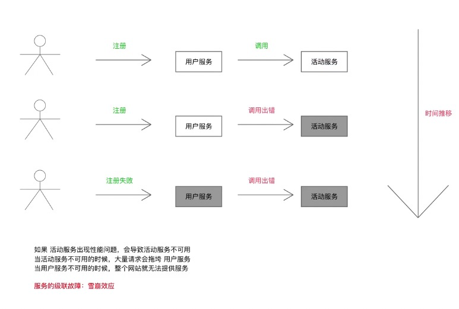
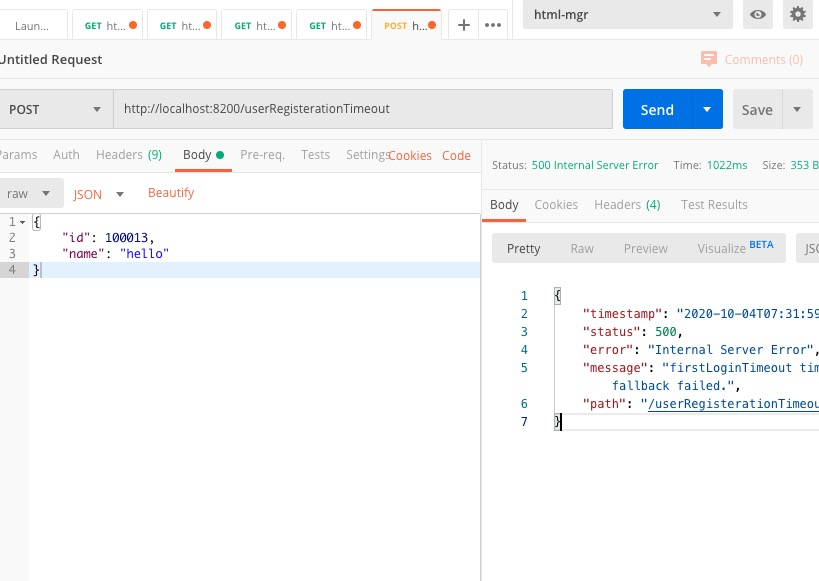
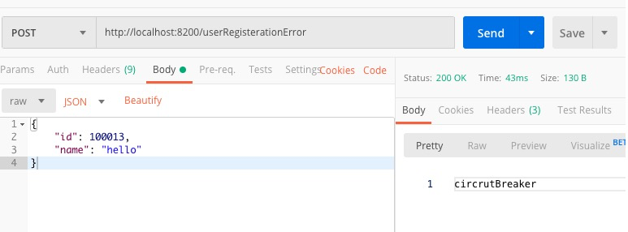
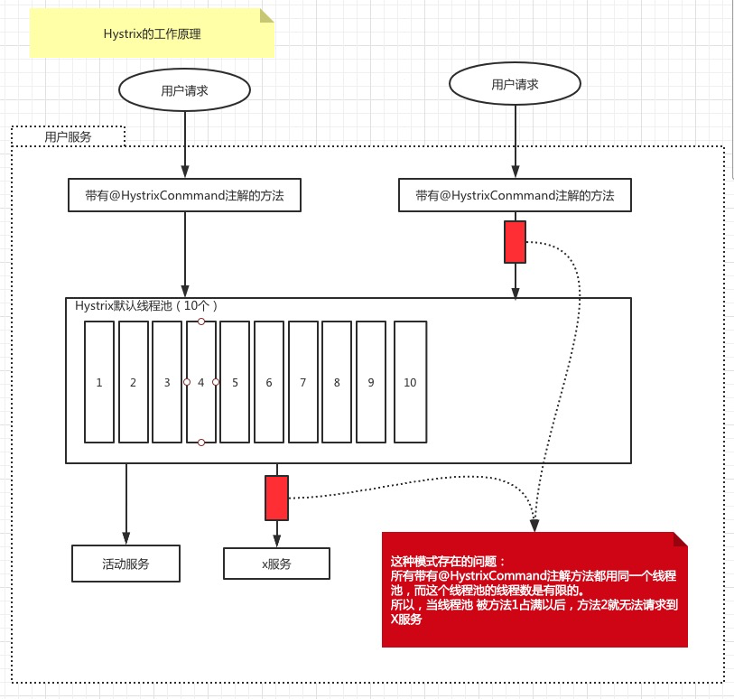
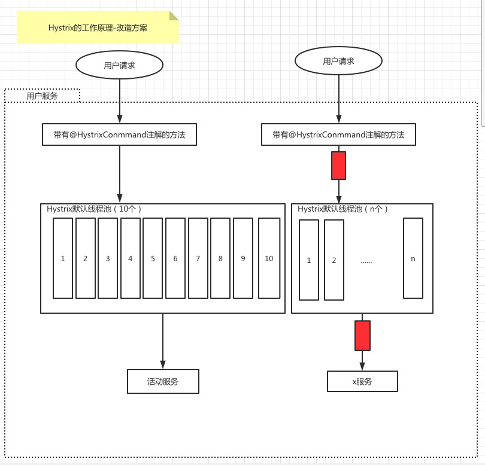
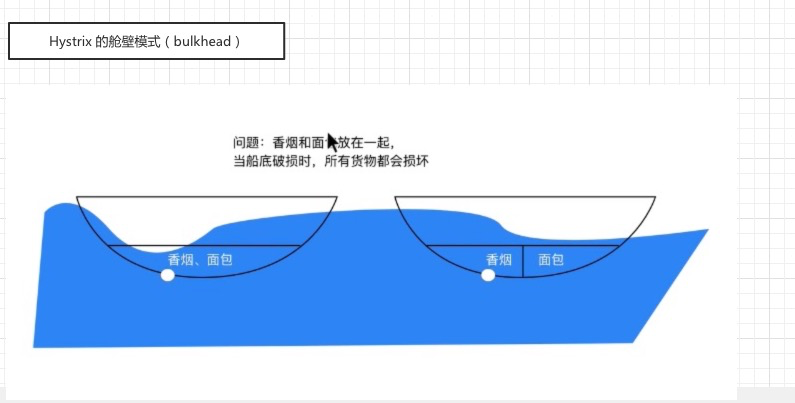
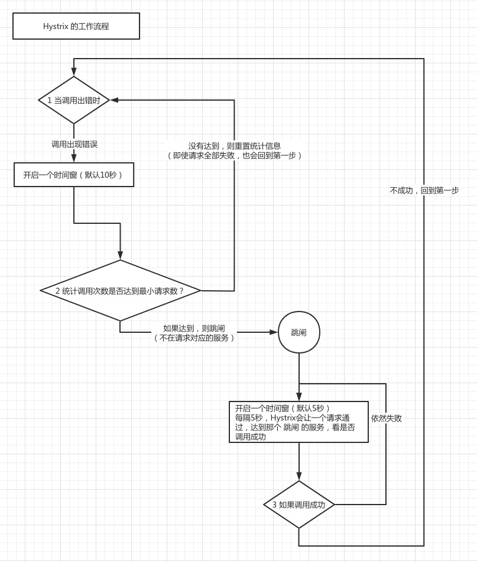

# Hystrix 原理和实战

<!--https://www.bilibili.com/video/BV1V4411F7my-->

## 目录
* 1 [Hystrix 的基本使用](#anchor1)
  * 为什么需要熔断器
  * 熔断器能解决什么问题
  * 如何使用断路器？
* 2 [Hystrix的工作原理与高级使用](#anchor2)
  * Hystrix 如何隔离服务调用
  * Hystrix 是如何工作的
  * 如何控制 Hystrix的行为？
* 3 [服务间调用 最佳实践](#anchor3)
* 4 [Hystrix与feign结合使用](#anchor4)
* 5 [如何监控 Hystrix来了解服务间调用的健康状况](#anchor5)

## 1 Hystrix 的基本使用
<a name="anchor1"><a>



创建工程3个项目
```
<module>hystrix-intro-register</module>
<module>hystrix-intro-activity</module>
<module>hystrix-intro-user</module>
```

### 1.1 hystrix-intro-register

Application.java
```java
@SpringBootApplication
@EnableEurekaServer
public class RegisterApplication {

    public static void main(String[] args) {
        SpringApplication.run(RegisterApplication.class, args);
    }

}
```
pom.xml
```xml
<dependency>
    <groupId>org.springframework.cloud</groupId>
    <artifactId>spring-cloud-starter-netflix-eureka-server</artifactId>
</dependency>
```

application.yml
```yaml
server:
  port: 8000
eureka:
  client:
    register-with-eureka: false
    fetch-registry: false
    serviceUrl:
      defaultZone: http://localhost:8000/eureka
  server:
    enable-self-preservation: false
```
### 1.2 hystrix-intro-activity

application.java
```java
@SpringBootApplication
@EnableDiscoveryClient
public class ActivityApplication {

    @Bean
    @LoadBalanced
    public RestTemplate restTemplate(){
        return new RestTemplate();
    }
    public static void main(String[] args) {
        SpringApplication.run(ActivityApplication.class, args);
    }
}
```

LoginActivityController.java
```java
@RestController
public class LoginActivityController {

    @PostMapping("firstLoginActivity")
    public String firstLoginActivity(@RequestBody Long userId){
        System.out.println("firstLoginActivity 初始化活动" + userId);
        return "ok";
    }
}
```

pom.xml
```xml
<dependency>
    <groupId>org.springframework.cloud</groupId>
    <artifactId>spring-cloud-starter-netflix-eureka-client</artifactId>
</dependency>
```

application.yml
```yaml
server:
  port: 8100
spring:
  application:
    name: hystrix-intro-activity
eureka:
  client:
    serviceUrl:
      defaultZone: ${EUREKA_URI:http://localhost:8000/eureka}
  instance:
    preferIpAddress: true
```


### 1.3 hystrix-intro-user

application.java
```java
@SpringBootApplication
@EnableDiscoveryClient
public class UserApplication {

    @Bean
    @LoadBalanced
    public RestTemplate restTemplate(){
        return new RestTemplate();
    }

    public static void main(String[] args) {
        SpringApplication.run(UserApplication.class, args);
    }

}
```

RegisterationController.java
```java
@RestController
public class RegisterationController {

    @Autowired
    private ActivityService activityService;

    /**
     * http://localhost:8200/userRegisteration
     *
     * @param user
     * @return
     */
    @PostMapping("/userRegisteration")
    public ResponseEntity<String> userRegistration(@RequestBody User user){

        System.out.println("用户注册 成功" + user.getName());

        return activityService.firstLogin(user.getId());
    }

}
```

ActivityService.java
```java
@Service
public class ActivityService {

    @Autowired
    private RestTemplate restTemplate;

    public ResponseEntity<String> firstLogin(Long userId) {

        return restTemplate.postForEntity("http://hystrix-intro-activity/firstLoginActivity", userId, String.class);
    }
}

```

pom.xml
```xml
<dependency>
    <groupId>org.springframework.cloud</groupId>
    <artifactId>spring-cloud-starter-netflix-eureka-client</artifactId>
</dependency>
```

application.yml
```yaml
server:
  port:8200
spring:
  application:
    name:hystrix-intro-user
eureka:
  client:
    server-url:
      defaultZone: http://localhost:8000/eureka

```


访问 http://localhost:8200/userRegisteration
入口参数
```json
{
	"id": 1000,
	"name": "hello"
}
```
出口参数
```
ok
```


### 1.4 Hystrix 的熔断

添加 hystrix的依赖

```xml
<dependency>
    <groupId>org.springframework.cloud</groupId>
    <artifactId>spring-cloud-starter-netflix-hystrix</artifactId>
</dependency>

```

在 activity项目中 的 LoginActivityController.java 中添加 超时 和 失败 用的调试方法

```java
@PostMapping("firstLoginActivityTimeout")
public String firstLoginActivityTimeout(@RequestBody Long userId)  {
    try {
        TimeUnit.SECONDS.sleep(RandomUtils.nextInt(5) + 1);
    }catch(InterruptedException e){
        e.printStackTrace();
    }
    System.out.println("firstLoginActivity 初始化活动 Timeout" + userId);
    return "ok";
}

@PostMapping("firstLoginActivityError")
public String firstLoginActivityError(@RequestBody Long userId)  {
    throw new RuntimeException("firstLoginActivity 初始化活动 failed " + userId);
}
```

在user项目中 的 application.java 中添加 Hystrix的声明

```
@SpringCloudApplication
```

在user项目的controller中添加调用的方法

```java
@PostMapping("/userRegisterationTimeout")
public String userRegistrationTimeout(@RequestBody User user){

    System.out.println("用户注册 成功" + user.getName());

    return activityService.firstLoginTimeout(user.getId());
}

@PostMapping("/userRegisterationError")
public String userRegisterationError(@RequestBody User user){

    System.out.println("用户注册 成功" + user.getName());

    return activityService.firstLoginFallback(user.getId());
}
```

在user项目中的activityService.java中添加熔断相关的方法

```java
@HystrixCommand(
        commandProperties = {
                @HystrixProperty(name= "execution.isolation.thread.timeoutInMilliseconds", value="2000")
        }
)
public String firstLoginTimeout(Long userId) {

    return restTemplate.postForObject("http://hystrix-intro-activity/firstLoginActivityTimeout", userId, String.class);
}

@HystrixCommand(fallbackMethod = "firstLoginFallback0")
public String firstLoginFallback(Long userId) {
    return restTemplate.postForObject("http://hystrix-intro-activity/firstLoginActivityError", userId, String.class);
}

public String firstLoginFallback0(Long userId) {
    return "circrutBreaker";
}
```


postman 请求验证






* 思考题： 当互动服务出现性能问题以后，我们只能眼睁睁的看着， 活动服务被压垮

## 2 Hystrix的工作原理与高级使用
<a name="anchor2"><a>

### 2.1 问题描述


这种模式存在的问题：
所有带有@HystrixCommand注解方法都用同一个线程池，而这个线程池的线程数是有限的。
所以，当线程池 被方法1占满以后，方法2就无法请求到 X服务




验证一下 userApplication的线程池

```shell script
$ jstack 37524 | grep -i hystrix
"hystrix-ActivityService-10" #101 daemon prio=5 os_prio=31 tid=0x00007fbe0dcd1800 nid=0xb003 waiting on condition [0x00007000138d2000]
"hystrix-ActivityService-9" #100 daemon prio=5 os_prio=31 tid=0x00007fbe0cb0f800 nid=0x14f03 waiting on condition [0x00007000137cf000]
"hystrix-ActivityService-8" #99 daemon prio=5 os_prio=31 tid=0x00007fbe0d4e4000 nid=0x15003 waiting on condition [0x00007000136cc000]
"hystrix-ActivityService-7" #98 daemon prio=5 os_prio=31 tid=0x00007fbe0d4e3800 nid=0x15203 waiting on condition [0x00007000135c9000]
"hystrix-ActivityService-6" #97 daemon prio=5 os_prio=31 tid=0x00007fbe0d4e0800 nid=0x890b waiting on condition [0x000070001269c000]
"hystrix-ActivityService-5" #96 daemon prio=5 os_prio=31 tid=0x00007fbe0ca82000 nid=0x8807 waiting on condition [0x0000700012599000]
"hystrix-ActivityService-4" #90 daemon prio=5 os_prio=31 tid=0x00007fbe0ccad800 nid=0xaa03 waiting on condition [0x00007000132c0000]
"HystrixTimer-4" #89 daemon prio=5 os_prio=31 tid=0x00007fbe0c3b8800 nid=0x7a07 waiting on condition [0x0000700012db1000]
"hystrix-ActivityService-3" #88 daemon prio=5 os_prio=31 tid=0x00007fbe0c8c3800 nid=0x8303 waiting on condition [0x00007000131bd000]
"HystrixTimer-3" #87 daemon prio=5 os_prio=31 tid=0x00007fbe0c39c000 nid=0x8003 waiting on condition [0x00007000130ba000]
"hystrix-ActivityService-2" #86 daemon prio=5 os_prio=31 tid=0x00007fbe0d4ab000 nid=0x7e03 waiting on condition [0x0000700012fb7000]
"HystrixTimer-2" #85 daemon prio=5 os_prio=31 tid=0x00007fbe0d4a8000 nid=0x7c03 waiting on condition [0x0000700012eb4000]
"NFLoadBalancer-PingTimer-hystrix-intro-activity" #78 daemon prio=5 os_prio=31 tid=0x00007fbe0d2b4000 nid=0x7503 in Object.wait() [0x00007000129a5000]
"hystrix-ActivityService-1" #76 daemon prio=5 os_prio=31 tid=0x00007fbe0cc74000 nid=0x7213 waiting on condition [0x000070001279f000]
"HystrixTimer-1" #75 daemon prio=5 os_prio=31 tid=0x00007fbe0db52000 nid=0xa70f waiting on condition [0x0000700010842000]
```

### 2.2 如何解决上诉问题？

* 首先 单纯添加线程数量是无法解决问题的。
* 考虑 使用 正常服务和 失败服务隔离的思路



### 2.3 hystrix的舱壁模式



添加 新的service 名为 ActivityServiceBluckhead.java

修改HystrixCommand， 添加 threadPoolKey 和 threadPoolProperties
```java
@HystrixCommand(
        threadPoolKey = "firstLoginTimeout",
        threadPoolProperties = {
                @HystrixProperty(name = "coreSize", value = "2"),
                @HystrixProperty(name = "maxQueueSize", value = "20"),
        },
        commandProperties = {
                @HystrixProperty(name= "execution.isolation.thread.timeoutInMilliseconds", value="1000")
        }
)
public String firstLoginTimeout(Long userId) {
}
```

```java
@HystrixCommand(
        threadPoolKey = "firstLoginFallback",
        threadPoolProperties = {
                @HystrixProperty(name = "coreSize", value = "1"),
                @HystrixProperty(name = "maxQueueSize", value = "20"),
        },
        fallbackMethod = "firstLoginFallback0")
public String firstLoginFallback(Long userId) {
}
```

从起 userApplication
```
jstack 49197 | grep -i hystrix
"hystrix-firstLoginFallback-1" #93 daemon prio=5 os_prio=31 tid=0x00007ffa3c570000 nid=0xab03 waiting on condition [0x000070000a4ef000]
"HystrixTimer-4" #90 daemon prio=5 os_prio=31 tid=0x00007ffa3c063800 nid=0xaa03 waiting on condition [0x000070000a3ec000]
"HystrixTimer-3" #88 daemon prio=5 os_prio=31 tid=0x00007ffa3aa63800 nid=0x8003 waiting on condition [0x000070000a1e6000]
"hystrix-firstLoginTimeout-2" #87 daemon prio=5 os_prio=31 tid=0x00007ffa3bd2a000 nid=0x7e03 waiting on condition [0x000070000a0e3000]
"HystrixTimer-2" #86 daemon prio=5 os_prio=31 tid=0x00007ffa3c063000 nid=0xa90b waiting on condition [0x0000700009fe0000]
"NFLoadBalancer-PingTimer-hystrix-intro-activity" #77 daemon prio=5 os_prio=31 tid=0x00007ffa3c56f800 nid=0x8703 in Object.wait() [0x0000700009bd4000]
"hystrix-firstLoginTimeout-1" #75 daemon prio=5 os_prio=31 tid=0x00007ffa3a814800 nid=0x8903 waiting on condition [0x00007000099ce000]
"HystrixTimer-1" #74 daemon prio=5 os_prio=31 tid=0x00007ffa3b325000 nid=0x8b13 waiting on condition [0x00007000098cb000]
```

发现之后 firstLoginFallback 和 firstLoginTimeout 分别占用2个线程池。


### 2.4 最终要达到的目的

* 如果活动服务出现性能问题
* 如果用户服务不继续请求，那么 活动服务肯定不会被压垮
* 如果继续请求，可能会被压垮，而是无意义的压垮

那么回到思考题：
* 思考题： 当互动服务出现性能问题以后，我们只能眼睁睁的看着， 活动服务被压垮，怎么实现系统？


### 2.5 详细解释一下 Hystrix的工作流程

如下图所示


文字描述如下
* 1 当调用出现错误时，开启一个时间窗（默认是10秒）
* 2 在这个时间窗内，统计调用次数是否达到最小请求数？
  * 如果没有达到，则充值统计信息，回到第1步 （即使请求全部失败，也会回到第一步）
  * 如果达到了，则同济失败的请求 占 所有请求数的百分比，是否达到阈值？
    * 如果达到，则跳闸（不在请求对应的服务）
    * 如果没有达到，则重置统计信息，回到第1步
* 3 如果跳闸，则会开启一个活动窗口（默认5秒），每隔5秒，hystrix会让一个请求通过，达到那个 跳闸的服务，看是否调用成功
  * 如果成功，重置断路器，回到第一步
  * 如果失败，回到第3步

其中 自定义断路器的行为
* 1 出现错误时 时间窗的长度
* 2 最小请求数
* 3 错误请求的百分比
* 4 跳闸后，活动窗口的长度

## 3 服务间调用 最佳实践
<a name="anchor3"><a>

### 3.1 添加新项目 activity-api

## 4 Hystrix与feign结合使用
<a name="anchor4"><a>

## 5 如何监控 Hystrix来了解服务间调用的健康状况
<a name="anchor5"><a>

